# 北美用户全流程实操审查与问题优先级

日期：2026-10-01；审查代码：`feat/ui-refactor` / `6ddee8d`。文档用途：记录实操发现，供后续排期与复测；本次未修改产品实现。

**结论：单个矩形房间的英制输入、门窗、家具、测量、3D 和项目文件流程可以使用；“导入独立屋图纸或从零创建完整房屋”的目标目前被输入与建模能力阻断。UI 重构完成不等于该产品流程已经完成。**

共记录 12 项：P0 两项、P1 四项、P2 六项。P0 在这里表示针对本次目标的上线阻断项，不表示已经发现崩溃、泄露或不可恢复的数据损坏。能力缺口、交互缺陷和待定位环境问题分开标注，不能全部称为代码 bug。

后续修复与逐项复测见 [2026-10-02 修复验收](NA-fixes-verification-2026-10-02.md)。以下保留原审查时点与问题证据。

## 问题索引

P0：独立屋全流程上线前必须解决；P1：影响北美用户起步或核心家具适配，应优先处理；P2：影响操作效率、显示或交付质量。下表状态仅表示本次审查结果，不代表已经修复。

| 编号 | 优先级 | 问题 | 类别 | 状态 |
|---|---|---|---|---|
| NA-001 | P0 | 独立屋图纸导入路径不存在 | 能力缺口 / 入口文案 | 待处理 |
| NA-002 | P0 | 无法从零建立多房间完整房屋 | 能力缺口 | 待处理 |
| NA-003 | P1 | 新用户默认中文、公制，切换入口不直观 | 本地化体验 | 待处理 |
| NA-004 | P1 | 当前来源出现新旧界面混用 | 运行异常 | 待定位 |
| NA-005 | P1 | Queen 搜索无结果，家具目录不适合当地常用规格 | 目录 / 搜索能力 | 待处理 |
| NA-006 | P1 | 家具挡门无开门冲突提示 | 家具适配能力 | 待处理 |
| NA-007 | P2 | 房间标签覆盖家具名称并进入导出图 | 显示缺陷 | 待处理 |
| NA-008 | P2 | 大房间初次 3D 和 Iso 取景裁切 | 取景交互 | 待处理 |
| NA-009 | P2 | 英制表单默认长小数，输入示例不直观 | 输入体验 | 待处理 |
| NA-010 | P2 | 连续添加门窗路径中断，墙选择重置 | 操作衔接 | 待处理 |
| NA-011 | P2 | 英语 / sq ft 模式仍显示人民币 / 平方米估价 | 区域适配 | 待处理 |
| NA-012 | P2 | 缺少打印交付选项，导出文件名固定 | 交付能力 | 待处理 |

## 实际操作范围与边界

- 通过 Computer Use 在 Codex 内置浏览器真实点击、选项选择、原生键入、两点测量；通过 Chrome 原生窗口补验实际下载和文件选择器回导。没有用测试脚本代替本次用户操作。
- 首先打开原 `127.0.0.1:8086`，发现新旧实现混用的表现。普通刷新仍可见旧右栏和空的分类选项；截图 01 留证。没有修改用户原页面的方案。
- 为避免影响已有本机方案，启动相同工作区的临时 `127.0.0.1:8093` 来源，在独立 localStorage / 缓存范围操作。Chrome 与内置浏览器各自的存储也不同。
- 无用户提供的真实独立屋文件。本次使用无地址、无个人信息的合成 PDF 测试文件，验证文件类型入口和拒绝反馈。没有验证实际建筑图纸的识别质量。
- 主场景：40×30×9 ft 的矩形主层；Bottom 墙入口门，偏移 3 ft、宽 36 in、高 80 in、Start 铰链、Inward 开启；Top 墙窗，偏移 10 ft、60×48 in、窗台 36 in；床自定义 60×80 in、中心 7×6 ft；沙发 90×36 in、中心 4.5×28.5 ft。上述家具是测试外形尺寸，不是厂商规格或实际床架尺寸认证。
- Chrome 补验场景：同为 40×30×9 ft，名称 `NA Chrome Roundtrip`，一件原库床。先导出 JSON，再添加第二件家具，导入刚下载的 JSON 后恢复为一件，最后导出 2D PNG。**这是独立补验场景，不声称与主场景两件家具、两个洞口、一个测量的 JSON 全量往返已经核对。**
- 内置浏览器导出事件明确为 `canceled`。Chrome JSON / 2D PNG 下载完成，因此不将该取消直接列为网站导出 bug。Chrome 浏览器控制接口不可用，改用原生窗口操作；用户随后切换了 Chrome 页面，未继续接管，3D PNG 在 Chrome 的落盘补验未完成。
- 临时 8093 服务和内置测试标签页已关闭，原 8086 服务保留并确认 HTTP 200。Chrome 在用户接管后未继续发送操作；测试标签的关闭未确认，不影响用户原标签。
- 没有执行付款、登录、云同步、真实手机、Safari/Firefox、辅助技术完整审计或建筑规范检查。

## 操作步骤与状态

| 步骤 | 实际操作 | 状态与发现 | 本次证据 |
|---|---|---|---|
| 1 | 打开当前站点并普通刷新 | 部分异常：旧右栏与新的搜索控件混用，分类无选项；新来源能得到一致版本 | [01](verification/NA-flow-audit/01-live-mixed-ui.jpg)、[02](verification/NA-flow-audit/02-clean-start.jpg) |
| 2 | 从新来源开始，找到 Settings，改为 EN / Feet & inches | 可完成；默认中文和 Metric，不适合直接面向美国英语新用户 | [03](verification/NA-flow-audit/03-import-menu.jpg) |
| 3 | Export / File → Import plan，选择合成独立屋 PDF | 阻断：accept 仅 `.json,application/json`，提示 `The file is not valid JSON.` | [PDF](verification/NA-flow-audit/detached-house-fixture.pdf)、[实际弹窗记录](verification/NA-flow-audit/04-pdf-import-rejected.txt) |
| 4 | New room plan，输入 40' / 30' / 9' 并 Create and replace | 矩形创建通过；无法继续分割为多个房间或新增楼层 | [05](verification/NA-flow-audit/05-new-house-form.jpg)、[06](verification/NA-flow-audit/06-house-no-partitions.jpg) |
| 5 | 选择 Bottom 墙，创建入口门；重新进入 Room / Openings，创建 Top 墙窗 | 数值、方向和洞口通过；连续编辑路径不顺，重新进入默认 Top 墙 | [07](verification/NA-flow-audit/07-openings-added.jpg) |
| 6 | Furniture 搜索 Queen，再搜索 bed，选择现有 Double Bed | Queen 无结果；bed 因匹配 Bedroom 分类返回整个卧室分类，可找到可修改模型 | [08](verification/NA-flow-audit/08-queen-search-empty.jpg) |
| 7 | 原生输入修改名称、60×80 in、中心 7×6 ft | 通过：画布名称更新，尺寸标签 60×80 in，面积 33.33 sq ft，坐标最终显示 84 / 72 in | [09](verification/NA-flow-audit/09-custom-bed-position.jpg) |
| 8 | 添加沙发并放入入口门内开扫掠区 | 放置通过，但完全遮住门扇弧线且无碰撞/门口提示 | [10](verification/NA-flow-audit/10-door-blocked-no-warning.jpg) |
| 9 | Measure，真实点击墙边和床边，切回 Select | 通过：得到约 4' 5 1/2" 的手动屏幕点选测量；不是精确吸附床边的校准验证 | [11](verification/NA-flow-audit/11-clearance-measured.jpg) |
| 10 | 3D View，再通过 View options → Iso 查看 | 预览通过；整个 40×30 ft 空间未完整入镜，边缘及沙发被裁切 | [12](verification/NA-flow-audit/12-3d-preview.jpg)、[13](verification/NA-flow-audit/13-3d-iso.jpg) |
| 11 | 点击 Export image / Export plan JSON | 内置浏览器取消下载；Chrome 补验 JSON、2D PNG 完成，JSON 回导恢复一件家具 | [14](verification/NA-flow-audit/14-export-feedback.jpg)、[15](verification/NA-flow-audit/15-chrome-roundtrip-download.jpg)、[实际 JSON](verification/NA-flow-audit/chrome-exported-project.json)、[实际 PNG](verification/NA-flow-audit/chrome-exported-2d.png) |
| 12 | 主场景刷新，再回 2D 并打开 Advanced | 通过：英语、英制、名称、两件家具、测量和洞口图形恢复；估价仍是 CNY/m² | [16](verification/NA-flow-audit/16-restored-project-advanced.jpg) |

## 问题清单

### NA-001｜P0｜独立屋图纸导入路径不存在

**类别：产品能力缺口＋入口文案不明确。**

复现：英文模式打开 Export / File → Import plan；文件选择器只接收 JSON。选择本轮 PDF 样本后，原生弹窗显示 `The file is not valid JSON.`，方案未被导入。

用户期望：拿着房源 PDF 或平面图开始工作，至少可导入为参考底图，设定比例后描绘房间。实际：只会读取该工具自己的项目数据。“Import plan” 没有在点击之前说明限制。

影响：已有房屋图纸的用户在第一步停住。不能以支持 JSON 项目恢复来宣称支持 house floor plan 导入。JPG/PNG、DWG/DXF 本轮未逐一上传；已确认当前文件入口仅接收 JSON。

建议：立即改为 `Open project (.json)` 并解释兼容范围；若承诺独立屋流程，优先建立 PDF/图片底图、已知距离标定和手工描绘路径，不必把自动识别作为首个实现。

验收：项目文件和图纸入口分开；图纸能显示、校准并保留；不支持类型给出下一步，而非“JSON 无效”。证据：步骤 3。

### NA-002｜P0｜新建的是一个矩形房间，无法建立完整房屋

**类别：产品能力缺口。**

复现：New room plan 创建 40×30 ft 后，在 Room 和 Room / Openings 寻找新增卧室、浴室、走廊、隔墙、楼层入口。可见操作仅是重新创建并替换当前方案、修改净尺寸、四面墙和门窗。新建说明明确是 replace，不是追加。

用户期望：将主层划分成多个相连空间，至少能表达实际单层独立屋。实际：1200 sq ft 被当作一个大房间，`Whole home` 也只是同一空间的取景入口。

影响：即使输入全部正确，得到的也不是用户自己的住宅布局。不能把“样例中有多个房间”当作“用户可以新建多个房间”。

建议：如近期仍卖单房间家具适配，应明确产品范围；如按本次独立屋定位，先完成多房间、共享隔墙、门窗归属，再按目标户型加入楼层。不要继续用 New room plan 代替 Add room。

验收：在一个项目中连续创建客厅、卧室、浴室，保存/恢复后空间关系、面积和洞口一致；新加房间不替换已有房屋。证据：步骤 4、截图 06。

### NA-003｜P1｜新用户默认中文与公制，英语/英制入口藏在 Settings

**类别：北美本地化体验缺陷。**

复现：全新来源首先呈现中文三室两厅示例，单位 mm/m²。必须识别中文“设置”，再点 EN，并单独选择 Feet & inches。

影响：英语用户在首屏就需要猜入口；示例背景、命名与单位也让产品看起来尚未面向当地。源码复核 `src/ui/i18n.js` 的无偏好 fallback 为 zh，不只是本机系统使用中文造成的结果。

建议：美国入口默认 English + Feet & inches，提供直观起步选择；保留已存项目单位，不因界面语言切换强制改项目。加拿大等市场允许显式选择 Metric，不把整个北美都锁为同一单位。

验收：没有本机偏好的英语用户直接读懂 Create / Open；已有项目仍保留自己的单位。本轮确认语言和单位设置后刷新可保留，**语言持久化不是 bug**。证据：步骤 2、截图 02/03。

### NA-004｜P1｜当前来源出现新旧界面混用，刷新未恢复一致

**类别：已观察到的运行异常；根因待定位。**

复现：在原 8086 来源打开新标签页并普通刷新。新的搜索/分类/Help 已出现，分类选项却为空；右栏仍展开旧的“房间面积/人民币估价/清空布置”，与当前源码和新来源的 Properties/Advanced 不同。

影响：用户刷新后可能仍未真正进入新版本，甚至把空分类误认为库坏了；仅用新 context 测试通过无法覆盖升级已有会话。

建议：核对实际加载的 HTML、ES modules、CSS 和响应缓存；随后设置一致的资源版本策略和升级回归。缓存是候选原因，**本轮没有证明具体缓存层或服务端故障，不以换端口为修复**。

验收：从上一版本已使用的来源升级并普通刷新，控件和事件绑定属于同一版本，分类有选项，属性栏不回到旧实现。证据：步骤 1、截图 01 与 02 对照。

### NA-005｜P1｜Queen 搜索无结果，家具目录仍以米制通用模型为主

**类别：家具目录与搜索能力缺口。**

复现：英文 Furniture 搜索 `queen`，显示 No furniture found；搜索 bed 才能找到 Double Bed 1.5m/1.8m，然后逐项修改宽、深、名称。

影响：北美用户按自己熟悉的床型寻找产品却无结果；易拿通用默认尺寸判断能否放下。改成英制显示并没有提供当地目录。

建议：补本地名称、常用床型和别名搜索，明确目录是示例外形；区分床垫名义尺寸与实际床架外廓，让用户录入厂商实际尺寸。不要直接把现有 1.5m 模型改名 Queen 而保留尺寸。

验收：相关名称能找到可解释的模型，卡片和属性的尺寸含义一致；用户仍能调整实际外廓。证据：步骤 6/7、截图 08/09。

### NA-006｜P1｜家具挡门仍可保存，没有开门冲突提示

**类别：核心家具适配能力缺口，不是“放置按钮坏了”。**

复现：Bottom 墙门偏移 36 in、宽 36 in、内开；沙发 90×36 in，中心 X=54、Y=342 in。沙发覆盖门内开区域，2D 门扇弧线被遮住，仍正常保存，无状态/右栏警告。

影响：产品能显示家具，但不能帮助用户识别这次操作产生的关键适配问题。用户仍需自己推断门能否打开，违背快速检查 fit/clearance 的任务。

建议：先对已建模门的扫掠范围做可见冲突提示，提供移开/定位冲突；不必一开始阻止所有放置，也不要把这个检查宣称为建筑法规认证。

验收：上述场景出现明确可定位提示，移走后消失，保存/恢复和旋转后重新计算；不能只把冲突区域绘制在被家具遮住的底层。证据：步骤 8、截图 10。

### NA-007｜P2｜房间标签覆盖家具名称，并进入导出图

**类别：已确认显示缺陷。**

复现：在 Chrome 新矩形空间中心添加床。默认房间名/面积与床名称重叠。导出的 `chrome-exported-2d.png` 同样包含重叠。

影响：画布和分享文件难读；图片生成成功不等于可交付的图纸清晰。

建议：允许移动/隐藏房间标签，导出时避免名称重叠并保持一致；不要用隐藏所有尺寸代替解决冲突。

验收：中心家具的名称与房间名均可读，导出文件也清晰。证据：步骤 11、实际 PNG。

### NA-008｜P2｜较大房间初次 3D 取景裁切，Iso 后仍不完整

**类别：取景交互缺陷。**

复现：40×30 ft 主层从 2D 进入 3D；左侧沙发、近侧角和部分边界不完整。点击 View options → Iso 后同样如此。2D 的 Fit view 不在 3D 画布工具中显示。

影响：用户无法一眼确认全部布局，不清楚应缩放、Whole home 还是调整相机。本轮没有尝试穷尽所有手势来证明“不能缩小”，问题是默认取景和明显入口。

建议：首次进入按当前房间边界和有效画布尺寸取景；提供直观的 3D Fit home/room，保留用户后续相机操作。

验收：在本轮画布尺寸下整个 40×30 ft 空间与两件家具可完整入镜。证据：步骤 10、截图 12/13。

### NA-009｜P2｜英制表单默认值是长小数，输入示例不直观

**类别：输入体验缺陷。**

复现：New rectangular room 默认宽 `157.48031496`、深 `118.11023622`、高 `110.23622047`，单位写 in，下面再给近似 ft/in；洞口偏移、宽高也来自类似转换。40' 等输入其实可以解析，但首次表单没有直观告诉用户支持这种写法。

影响：用户先面对不常见的长度表达与大段范围说明，容易手工换算英尺或误以为只能输入小数英寸。

建议：新建的示例值采用易读英制示例并注明必须实测；给 `12' 6" / 150 in` 这种输入提示。既有精确值保持原精度，不能为了好看直接舍入已有模型。

验收：首次输入方式清楚，近似摘要不写回真实数据。证据：步骤 4/5 的本轮表单 DOM 记录，截图 05。

### NA-010｜P2｜添加一个洞口后，连续添加路径中断且墙选择重置

**类别：流程衔接缺陷。**

复现：Bottom 门 Apply 后，右栏只显示 Door properties / Edit / Delete，Add window 不再存在；需要再次点顶部 Room / Openings，此时默认 Top 墙，原 Bottom 上下文丢失。

影响：给同一面墙连续放门窗时多一次找入口和重新选墙，容易把下一扇窗加在错墙。

建议：提供 Back to wall / Add another，或重开时保留最后墙选择；选中洞口时仍让用户看得见如何继续。

验收：Bottom 墙添加门后可直接继续添加该墙窗，当前墙不会静默变成 Top。证据：步骤 5，实际操作状态；截图 07 显示洞口详情状态。

### NA-011｜P2｜英语和 sq ft 模式下，估价仍是人民币/平方米示例

**类别：区域适配缺口；不是金额换算计算错误。**

复现：Advanced 显示 `1200.00 sq ft`、`example prices: CNY/m²`、`¥37,459`。

影响：示例币种有明确标注，但对北美消费者没有决策用途；付费工具中这种混合单位/币种容易降低可信度。

建议：没有当地价格依据时先隐藏商业估价或提供用户自填的币种与单位单价，不把换美元符号当作本地估价。

验收：当地模式的估价输入、单位、币种自洽，默认示例范围清楚；不伪造当地报价。证据：步骤 12、截图 16。

### NA-012｜P2｜只有 PNG/JSON 导出，缺少打印交付选项与项目化文件名

**类别：交付能力缺口。**

复现：Export / File 只有 Export image 与 Export plan JSON；没有 Print/PDF、纸张、比例、图例入口。本轮 Chrome 下载固定名 `floorplan-project (2).json` 和 `floor-plan-design.png`，没有使用项目名。

影响：发给家人/施工方或比较多个方案时，文件容易混淆；PNG 不能直接表达按指定纸张、比例打印。不能声称“有 PNG”就是“可按比例打印”。

建议：先补项目名/方案名/日期文件名与清楚的 2D/3D 导出选择；按需求加入 PDF/打印设置。CAD/BIM 格式本轮未验证，也不作为本次必须全部新增的要求。

验收：两个方案导出的文件可区分；若提供打印比例，纸张尺寸和实际距离可校验。证据：步骤 11、截图 03/15 和本轮下载文件。

## 优先修复顺序

1. 明确近期付费承诺的范围。对“独立屋图纸→全屋方案”的承诺，先处理 NA-001/002；若先卖单房间适配，入口和营销必须如实表达该范围。
2. 处理 NA-004 升级会话一致性与 NA-003 英文/单位默认，不让用户连新界面都无法稳定进入。
3. 补 NA-005 家具目录与 NA-006 挡门提示，让“家具是否放得下”成为可完成的核心任务。
4. 处理标签/相机、输入与连续编辑；再补可辨认的导出文件和打印交付。
5. 无当地价格基础时，收起 NA-011 的非当地估价，避免增加无用数字。

## 已确认的有效路径

- 英语和英制可以设置并保留；手工输入 ft/in 可生效；自定义名称可正确显示。
- 单矩形净尺寸、门窗的相对墙基准可编辑；创建前说明替换，并提供导出与撤销。
- 两点测量可保存；主场景刷新恢复名称、单位、两件家具、一个测量及洞口图形。
- Chrome 实際 JSON 下载和回导、2D PNG 落盘可完成。数据文件是 v2，内部仍是毫米，不将内部 mm 视为用户单位 bug。

## 证据限制与排除项

- PDF 拒绝弹窗本次截图 API 不允许截图；已保存实际 AX 弹窗文本。不能补造弹窗图片。
- 内置浏览器下载取消记录见 [download-environment-canceled.json](verification/NA-flow-audit/download-environment-canceled.json)。没有证明普通浏览器同样失败；Chrome 2D/JSON 已通过。
- CUA locator 的 fill/Tab 首轮未使部分家具值真正提交。改用原生键盘，并核对画布名称、尺寸、面积和位置后完成；这个工具输入差异未列入网站 bug。
- 报告中的图均来自本轮实操或本轮实际下载。过渡中的刷新截图被舍弃，未用旧验收截图填补流程。
- 无 P0 技术故障或不可恢复数据丢失的已确认案例；NA-004 的具体根因仍待定位。没有将主观偏好、未实现能力、环境取消都混算为回归 bug。
- 屏幕可读性/标签问题已观察；未做完整键盘覆盖、屏幕阅读器和对比度测量，不宣称 WCAG 合规。

## 本轮截图（按操作顺序）

### 1. 原来源混用界面

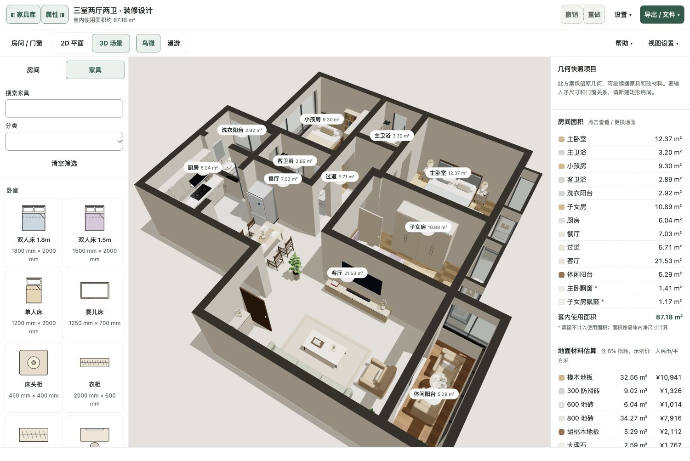

### 2. 独立来源默认状态

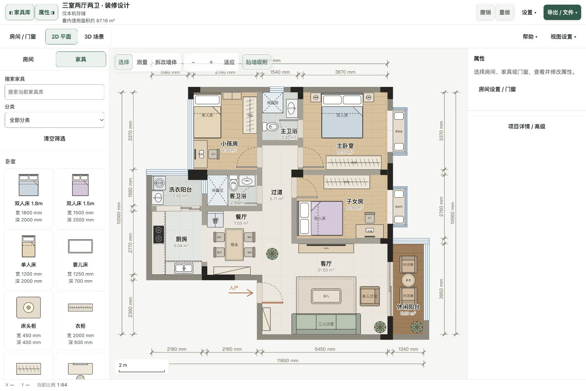

### 3. 英文导入与导出入口

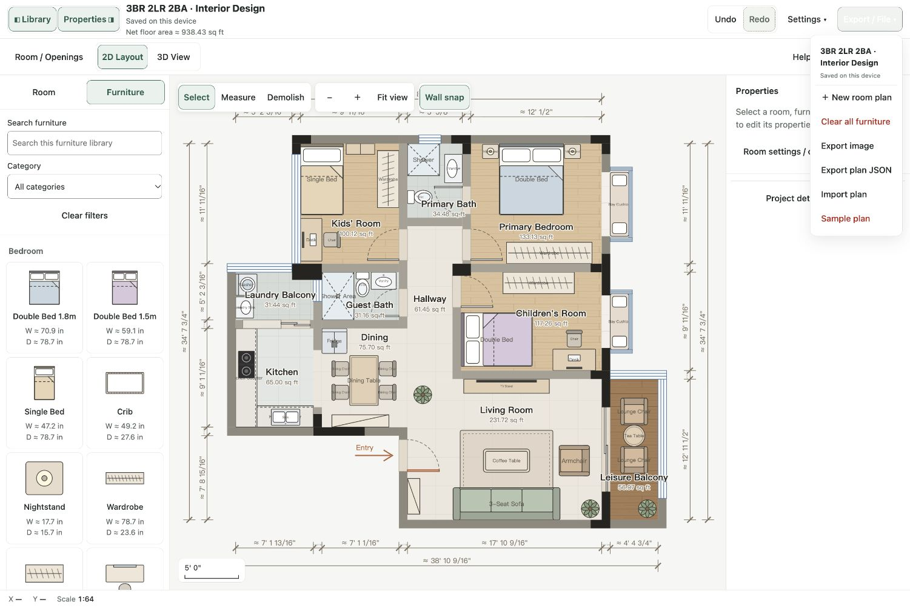

### 4. 新建净尺寸表单

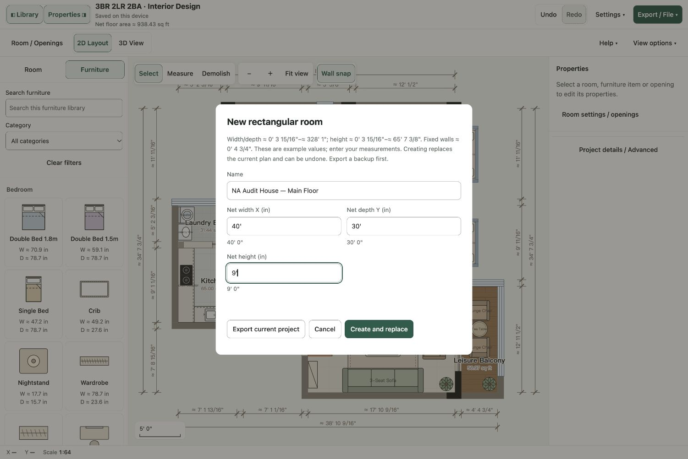

### 5. 新房屋实际仅是一个房间

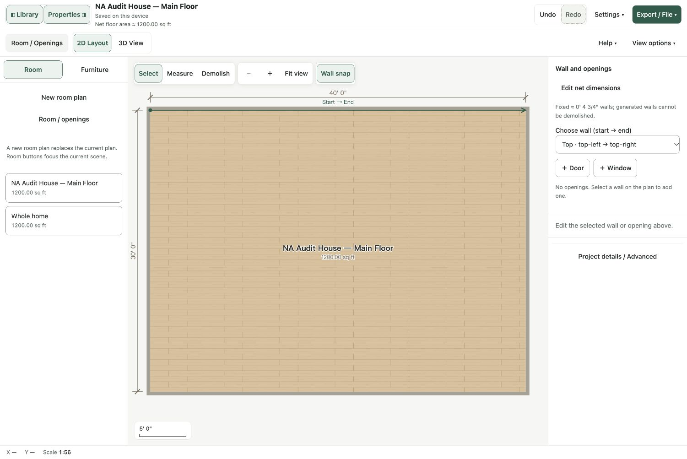

### 6. 已添加门窗

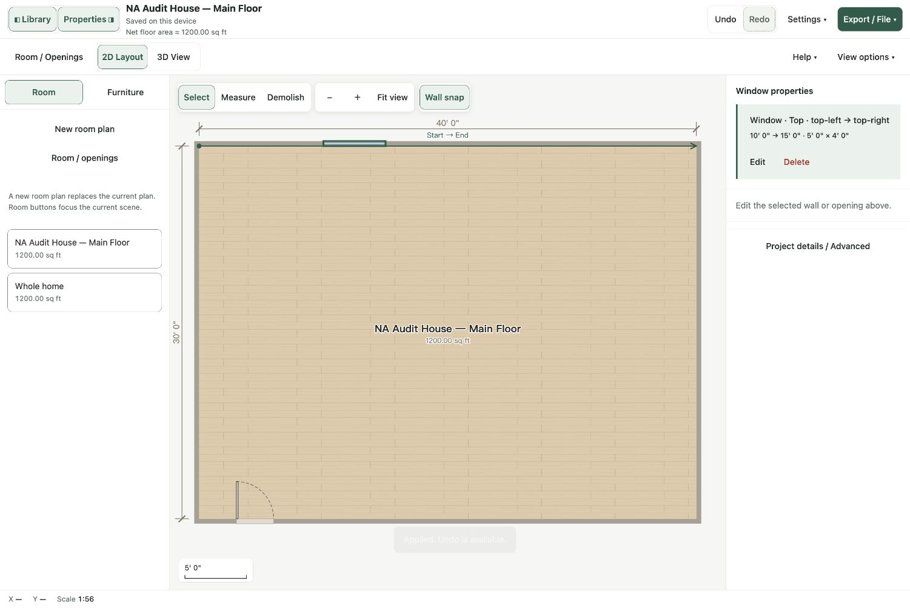

### 7. Queen 搜索无结果

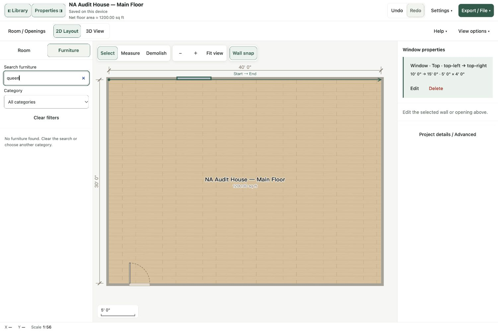

### 8. 原生输入提交后的自定义床

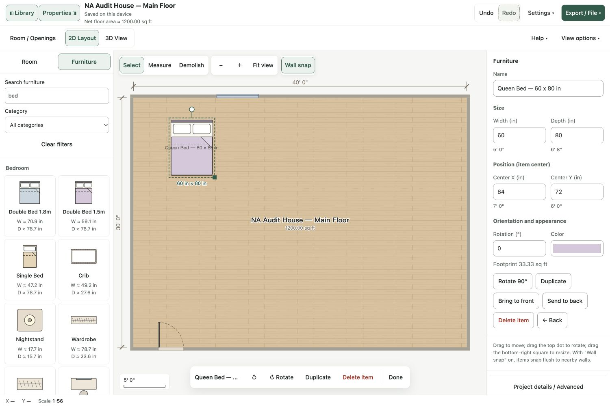

### 9. 沙发挡门且未提示

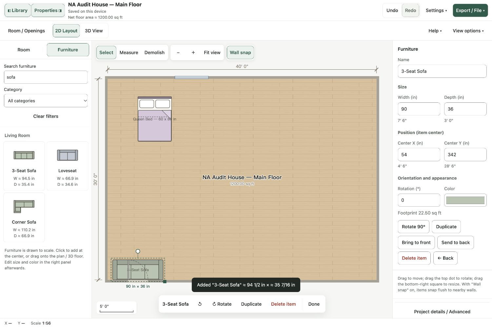

### 10. 两点测量

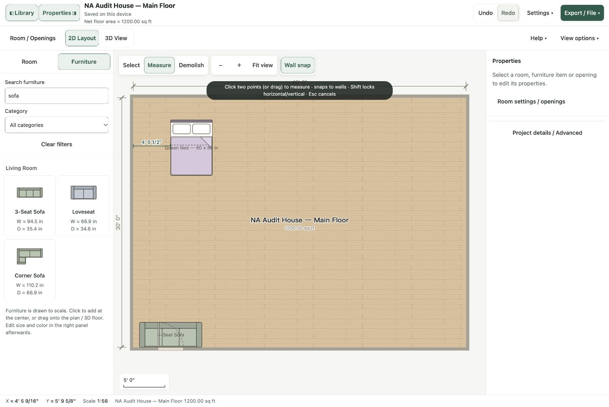

### 11. 3D 默认取景与 Iso

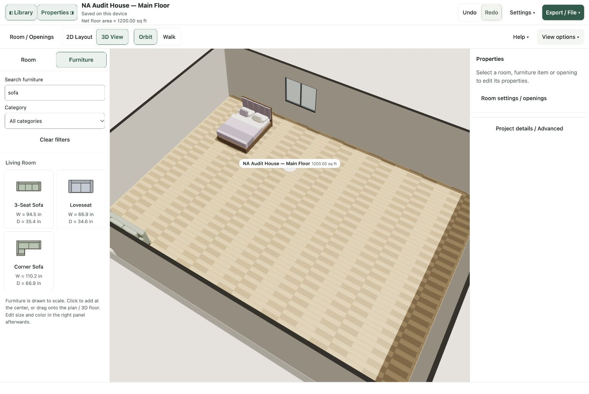

### 12. 实际导出与回导

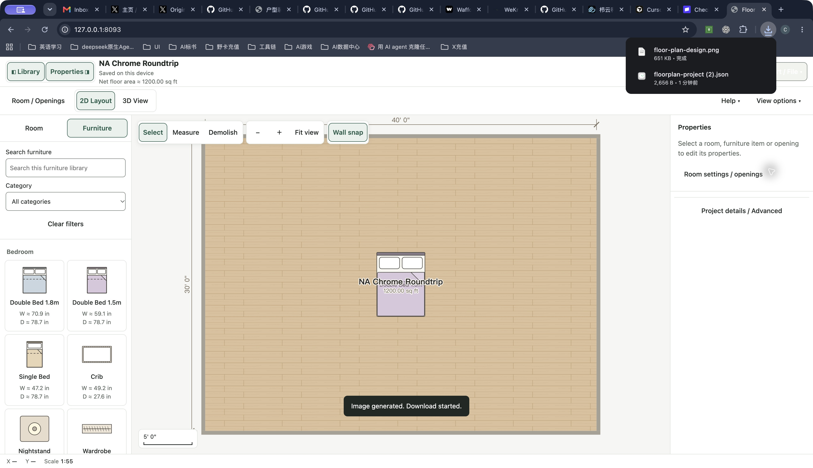

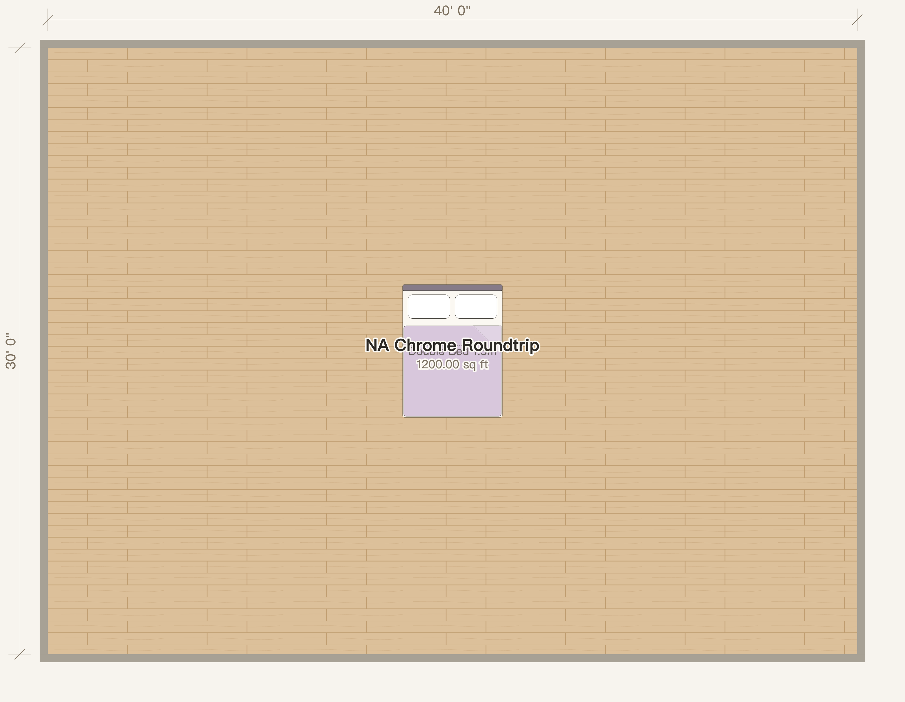

### 13. 主场景刷新恢复与高级详情

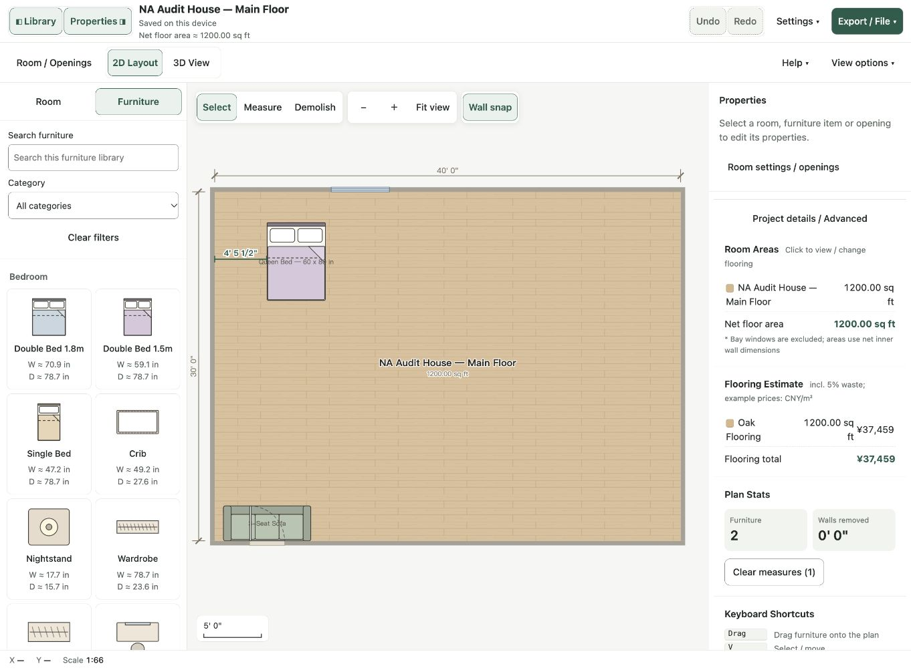
