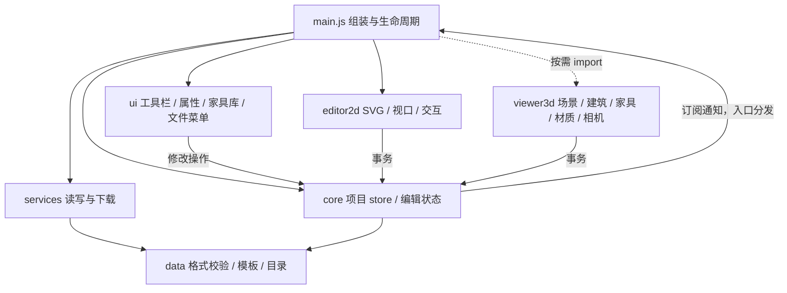

# 项目架构说明（T03）

[项目首页](../README.md) · [验收记录](T01.1-verification.md) · [v2 数据约定](T02-project-data.md)

## 入口与依赖

应用使用原生 ES Modules，无构建步骤、前端框架或运行时 npm 依赖。`index.html` 只保留静态 DOM、Three.js r160 import map、样式链接和模块入口。根目录的 `project-data.js` / `sample-template.js` 是 ESM 转导出入口；实现位于 `src/data/`。

核心数据模块不引用 DOM、Three.js 或 UI。UI 之间需要选中、关闭抽屉或切换视图时使用注入的操作接口；2D 与 3D 不互相导入。没有 `window.View3D`、`window.select`、`window.ProjectData` 等业务桥接。

## 模块职责

| 路径 | 职责 |
| --- | --- |
| `src/main.js` | 创建 store、服务和组件，订阅更新，协调语言、视图切换及销毁；导出 `createApplication()` 和当前 `application` |
| `src/core/project-store.js` | 唯一项目对象、150 步历史、事务、替换与订阅；无 DOM |
| `src/core/editor-state.js` | 工具、选择、测量中的临时端点；图层通过 getter 读取当前项目 |
| `src/core/geometry.js` | 面积、周长、包围盒、旋转包围盒、颜色等纯函数 |
| `src/data/` | v2 格式/校验、v1/旧文件迁移、矩形纯模型及几何生成、原几何模板、家具/材料目录、默认项目工厂 |
| `src/services/storage.js` | 注入存储适配器；新旧键读取、恢复备份、明确的 `{ok,error}` 保存结果 |
| `src/services/project-files.js` | 解析、确认需求、校验与序列化；备份成功后才允许替换，不调用浏览器对话框 |
| `src/services/downloads.js` | JSON/PNG 下载、SVG 栅格化和 Blob URL 的释放 |
| `src/editor2d/` | `editor` 组装 SVG renderer、viewport、snapping、interactions；defs 与家具 SVG 图例独立 |
| `src/ui/room-editor.js` | 矩形新建/编辑和门窗表单草稿、独立模态框、墙/门窗列表；校验候选成功后一次替换 |
| `src/ui/` | toolbar、drawers、property-panel（含浮动条）、furniture-library、file-menu、notifications、i18n；`project-actions` 把既有 UI 操作接入 store |
| `src/viewer3d/` | viewer 持有场景/拾取/漫游/动画；architecture 生成建筑；furniture 保留原模型函数；materials 管理缓存与纹理；navigation 计算相机位姿 |

项目替换、撤销/重做与新表单打开前取消 2D/3D 手势。模态框阻止画布快捷键；销毁时移除模态框和监听。

主要 UI 组件有 `update()` / `dispose()`；事件与观察器由 `createScope()` 配对清理。布局骨架仍用静态 HTML；没有为了拆分而引入组件框架。

## 状态与修改边界

| 状态 | 所有者 | 是否进入 JSON/历史 |
| --- | --- | --- |
| 几何、家具、房间设置、测量、拆墙、单位/布局/视图偏好 | store | 是 |
| 选择、工具、当前测量起点 | editor state | 否 |
| 2D 平移与缩放 | viewport | 否 |
| 指针拖动/捏合、家具库拖放预览 | 对应 interactions / library | 否 |
| 3D 相机、Orbit/PointerLock controls、门扇动画、照明和剖切设置 | viewer | 否（保持既有范围） |
| SVG、DOM、Canvas、WebGL/材质/纹理、监听器和计时器 | 对应组件 | 否 |
| 本地读取错误、恢复备份是否需要 | storage 服务 | 否 |

- `getProject()` 返回当前对象，只用于读取或明确事务内修改。组件不缓存可编辑项目副本；导入/撤销后读取的都是新对象。
- 单次编辑使用 `store.mutate(fn)`。拖动使用 `begin()` → 多次 `preview(fn)` → `commit()`；取消使用 `cancel()`。预览不保存、不通知整页更新、不追加历史。
- 2D 预览只更新家具与选择 SVG；3D 预览只移动对应模型。松手才提交和保存。取消还原数据及 3D 模型位置；无变化的点击不产生撤销记录。
- `replaceProject()` 整体替换并加入历史。撤销/重做覆盖几何、家具和偏好；新编辑清空重做分支。订阅通知包含当前项目和原因，取消不写存储。
- `setView()` 保存既有视图偏好，不创建单独撤销步。`updatedAt` 在实际编辑或偏好变化时更新；普通渲染和语言切换不修改项目时间。
- 当前运行模式与项目期望模式分开管理。待恢复的 `3d` 不会被 2D 启动过程改写；成功进入视图后才保存模式。CDN/WebGL 失败时保留项目，2D 和文件操作可继续使用。

## 读写与兼容

当前导出 `format: floorplan-3d`、`version: 2`，长度仍为浮点毫米。`roomEditor:null` 是原几何快照；`rectangle` 项目从房间参数、稳定门窗 ID/父墙及 `rooms[roomId]` 名称/材料生成几何。生成字段、容差、范围及兼容规则见 [v2 数据约定](T02-project-data.md)。

`src/data/room-editor.js` 负责参数校验与确定性几何；`project-data.js` 负责完整项目校验、v1迁移和候选项目工厂。UI 草稿不进入 store；成功后原子提交参数和几何。新增/修改/删除门窗和房间替换均一次撤销，失败或无变化不污染历史。

v1 按原规则验证后迁移到 v2 快照，保留墙段顺序和 `wN` 拆墙引用。文件菜单负责提示，服务负责校验。旧文件返回 `confirmation-required`；确认后先验证迁移结果，再下载原始文本备份，最后替换。坏 JSON、未来版本及快照不一致均拒绝。

存储读取 `floorplan-project-v2` → `floorplan-project-v1` → `huxing-design-v1`，只有不存在才回退。v1 自动保存迁移副本到 v2，失败仍保留内存项目并通知；旧键不改写。坏 v2 覆盖前写唯一 recovery，备份失败拒绝覆盖。保存和导出使用相同校验。

SVG `data-wall` 在矩形模式为逻辑墙 ID，快照模式仍是 `wN`；门窗有 `data-opening`。选择和父墙方向属于临时状态，不持久化。Three.js 沿用同份生成几何，按实际门宽建立门扇与近似漫游阻挡；房间原点/层高变化会重建家具世界坐标、建筑、标签并重新取景。矩形生成墙体禁止拆除。

## 生命周期与资源

`application.dispose()` 先取消 store 订阅，然后销毁各组件。`createScope()` 清理监听器、ResizeObserver、待执行计时器，并使等待中的延时正常结束。家具库采用容器事件委托，语言切换不会累积旧条目监听器。

3D 退出停止 RAF；销毁还会释放 controls、选择辅助对象、场景几何、阴影贴图、PMREM render target、Canvas 和标签 DOM。普通重建只释放几何；共享材质/地面纹理由材质缓存统一销毁，避免多个 mesh 重复释放同一材质。下载服务回收 Blob URL，销毁后不再触发迟到的图片下载。迟到的 3D import 或文件读取也不会重新挂载已销毁组件。文件读取带请求序号与项目修订检查，读取期间项目变化则要求重新导入；异步鼠标锁定拒绝被捕获，退出视图后的锁定结果立即释放。

## 后续任务接入点

- **T02 已实现**：结构参数纯模型与表单组件保持独立；后续新形状不能直接复用 rectangle 并偷换其语义，应显式扩展格式及校验。
- **T03 已实现**：`core/units.js` 为无 DOM 的换算、严格解析、显示/编辑格式化、步长与网格模块；`ui/length-field.js` 管理字段提示与原值保护。几何仍为浮点毫米。
- **T02 已修正**：房间面板墙面面积采用实际 `geometry.height`，注明未扣门窗。3D PNG 仍是 WebGL Canvas 截图，不包含 CSS2D 房间标签；完整交付图属于 T09/T12。

## T03 单位与编辑精度

- `parseLengthMm` 返回 `{ok,mm}` 或 `{ok:false,code}`；完整匹配语法，范围由字段和原数据校验器检查。默认 metric 无后缀为 mm，imperial 为总 in；语言不参与解析。
- `formatLengthMm` 为最近 1/16 in 的展示值（有损时加 ≈），`formatAreaM2` 的入参明确为 m²。`formatEditLengthMm` 使用精确 1/64 分数或最多 8 位小数英寸；metric 最多 6 位小数。显示文本不可回写。
- 每个字段保存打开时的编辑文本及原始 mm；文本恢复原样时直接返回原 float。房间与洞口全表单验证后原子替换；家具单字段验证通过后一笔 mutate。Escape 恢复草稿，Enter 提交。
- 单位选择调用 `store.mutate`，同值无历史；房间/门窗模态框期间及家具长度字段聚焦时禁用并说明原因。新房间继承当前 units。数值输入不吸附。
- `unitStepMm` 供放置、2D/3D 共用移动吸附、resize、键盘与测量使用；精确墙吸附仍优先。`gridSizeMm` 控制主/次网格，viewport 按项目单位刷新比例尺而不 fit。
- store 通知刷新现有 UI；家具库仅在单位或语言变更时重绘。3D 单位只加入标签签名；建筑和家具签名不含单位。相机、门动画保持原有运行时所有权。
- v2 与现有三个存储键保持不变；旧文件沿用原迁移；无版本文件若携带 units 则保留并校验，缺失时默认 metric。材料金额仍用未转换的 m² × CNY/m² 计算；只转换面积显示。

## 项目名称与目录译名（T08）

`src/ui/i18n.js` 的 `nm(name)` 原样显示项目实体名称；只有已知内置目录 / 材料标签调用 `nm(name, true)` 才按当前语言译名。旧项目没有可靠名称来源标记，不按精确词典匹配推断用户意图，也不迁移名称。目录新增家具在创建时采用当时的显示名称，后续切语言不改已有名称或工程数据。静态可访问名称使用 `data-en-aria-label`，与可见文案及 title 同步；Help 只管理 UI 开关，不接入 store。
