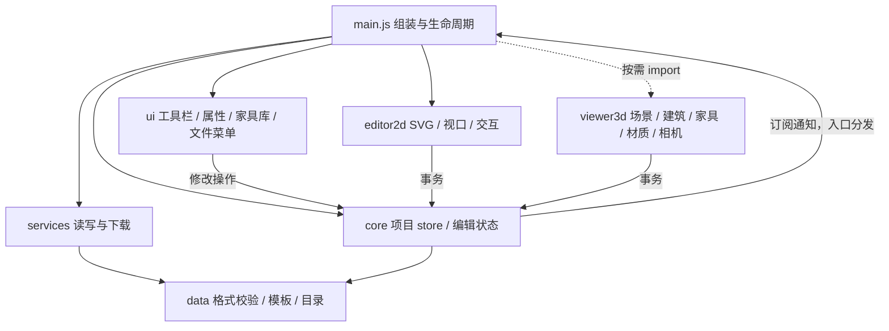

# T01.1 架构说明

[项目首页](../README.md) · [验收记录](T01.1-verification.md) · [v1 数据约定](T01-project-data.md)

## 入口与依赖

应用使用原生 ES Modules，无构建步骤、前端框架或运行时 npm 依赖。`index.html` 只保留静态 DOM、Three.js r160 import map、样式链接和模块入口。根目录的 `project-data.js` / `sample-template.js` 是 ESM 转导出入口；实现位于 `src/data/`。

核心数据模块不引用 DOM、Three.js 或 UI。UI 之间需要选中、关闭抽屉或切换视图时使用注入的操作接口；2D 与 3D 不互相导入。没有 `window.View3D`、`window.select`、`window.ProjectData` 等业务桥接。

## 模块职责

| 路径 | 职责 |
| --- | --- |
| `src/main.js` | 创建 store、服务和组件，订阅更新，协调语言、视图切换及销毁；导出 `createApplication()` 和当前 `application` |
| `src/core/project-store.js` | 唯一项目对象、150 步历史、事务、替换与订阅；无 DOM |
| `src/core/editor-state.js` | 工具、选择、测量中的临时端点；图层通过 getter 读取当前项目 |
| `src/core/geometry.js` | 面积、周长、包围盒、旋转包围盒、颜色等纯函数 |
| `src/data/` | v1 格式/校验/显式旧文件迁移、原几何模板、家具/材料目录、默认项目工厂 |
| `src/services/storage.js` | 注入存储适配器；新旧键读取、恢复备份、明确的 `{ok,error}` 保存结果 |
| `src/services/project-files.js` | 解析、确认需求、校验与序列化；备份成功后才允许替换，不调用浏览器对话框 |
| `src/services/downloads.js` | JSON/PNG 下载、SVG 栅格化和 Blob URL 的释放 |
| `src/editor2d/` | `editor` 组装 SVG renderer、viewport、snapping、interactions；defs 与家具 SVG 图例独立 |
| `src/ui/` | toolbar、drawers、property-panel（含浮动条）、furniture-library、file-menu、notifications、i18n；`project-actions` 把既有 UI 操作接入 store |
| `src/viewer3d/` | viewer 持有场景/拾取/漫游/动画；architecture 生成建筑；furniture 保留原模型函数；materials 管理缓存与纹理；navigation 计算相机位姿 |

主要 UI 组件有 `update()` / `dispose()`；事件与观察器由 `createScope()` 配对清理。布局骨架仍用静态 HTML；没有为了拆分而引入组件框架。

## 状态与修改边界

| 状态 | 所有者 | 是否进入 JSON/历史 |
| --- | --- | --- |
| 几何、家具、房间设置、测量、拆墙、单位/布局/视图偏好 | store | 是 |
| 选择、工具、当前测量起点 | editor state | 否 |
| 2D 平移与缩放 | viewport | 否 |
| 指针拖动/捏合、家具库拖放预览 | 对应 interactions / library | 否 |
| 3D 相机、Orbit/PointerLock controls、门扇动画、照明和剖切设置 | viewer | 否（保持既有范围） |
| SVG、DOM、Canvas、WebGL/材质/纹理、监听器和计时器 | 对应组件 | 否 |
| 本地读取错误、恢复备份是否需要 | storage 服务 | 否 |

- `getProject()` 返回当前对象，只用于读取或明确事务内修改。组件不缓存可编辑项目副本；导入/撤销后读取的都是新对象。
- 单次编辑使用 `store.mutate(fn)`。拖动使用 `begin()` → 多次 `preview(fn)` → `commit()`；取消使用 `cancel()`。预览不保存、不通知整页更新、不追加历史。
- 2D 预览只更新家具与选择 SVG；3D 预览只移动对应模型。松手才提交和保存。取消还原数据及 3D 模型位置；无变化的点击不产生撤销记录。
- `replaceProject()` 整体替换并加入历史。撤销/重做覆盖几何、家具和偏好；新编辑清空重做分支。订阅通知包含当前项目和原因，取消不写存储。
- `setView()` 保存既有视图偏好，不创建单独撤销步。`updatedAt` 在实际编辑或偏好变化时更新；普通渲染和语言切换不修改项目时间。
- 当前运行模式与项目期望模式分开管理。待恢复的 `3d` 不会被 2D 启动过程改写；成功进入视图后才保存模式。CDN/WebGL 失败时保留项目，2D 和文件操作可继续使用。

## 读写与兼容

`format: floorplan-3d`、`version: 1` 和浮点毫米语义均保留。墙段不重排，`demolished` 仍引用 `w` 加索引。项目/家具 ID、创建时间、小数尺寸、旋转、材料、单位偏好及缺省/显式家具高度继续有效。

文件菜单负责提示，服务负责校验。旧文件返回 `confirmation-required`；取消不替换。确认后先验证迁移结果，再下载原始文本备份，最后替换项目。坏 JSON、未知格式、未来版本、读取/备份失败不覆盖项目。

存储键继续为 `floorplan-project-v1` 和 `huxing-design-v1`。坏的新键数据在第一次后续写入前写入唯一 recovery 键；备份失败就拒绝覆盖。旧键不改写。保存服务失败由 UI 显示备份提示。

## 生命周期与资源

`application.dispose()` 先取消 store 订阅，然后销毁各组件。`createScope()` 清理监听器、ResizeObserver、待执行计时器，并使等待中的延时正常结束。家具库采用容器事件委托，语言切换不会累积旧条目监听器。

3D 退出停止 RAF；销毁还会释放 controls、选择辅助对象、场景几何、阴影贴图、PMREM render target、Canvas 和标签 DOM。普通重建只释放几何；共享材质/地面纹理由材质缓存统一销毁，避免多个 mesh 重复释放同一材质。下载服务回收 Blob URL，销毁后不再触发迟到的图片下载。迟到的 3D import 或文件读取也不会重新挂载已销毁组件。

## 后续任务接入点（本次未实现）

- **T02**：新增几何编辑操作，通过 store 事务提交；同时修改数据校验、SVG/建筑生成及夹具。必须保持墙段索引引用或提供显式迁移，不可直接重排墙体。
- **T03**：新增独立单位解析/格式化函数，在属性面板、标注、目录及导出显示处调用；store 中仍保持浮点毫米。当前 `imperial` 仅为已保留的偏好。
- **已登记旧问题**：房间面板墙面估价仍使用固定 2.8m 层高，沿用旧逻辑；不应把它当成导入项目的精确工程量。随房间属性工作校正。3D PNG 仍是 WebGL Canvas 截图，不包含 CSS2D 房间标签；完整交付图属于 T09/T12。
