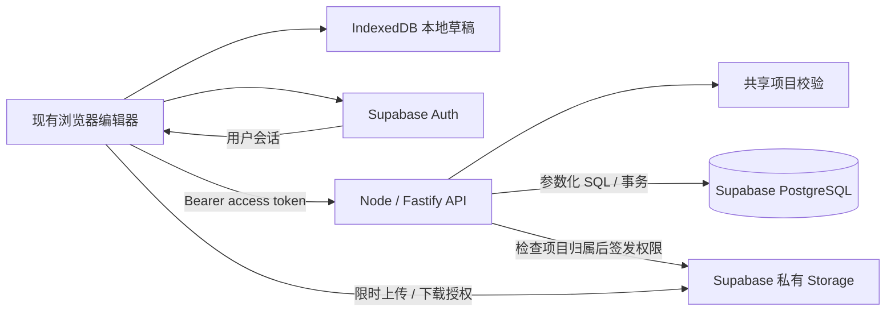

# floorplan-3d 后端技术选型建议

日期：2026-10-05。状态：技术方案建议，供后续实施和采购使用。

2026-10-07 更新：后端基础设施已按 [Cloudflare 任务清单](backend-task-checklist-cloudflare-2026-10-07.md)实施开发基础；本文件保留早期 Fastify / Supabase 方案及业务依据，现行资源配置见 [开发环境配置](backend-cloudflare-configuration-2026-10-07.md)。BE-01 真实账号 / 保存 / CPU 出口尚未通过。

依据：[后端、账号与权限接入评估](backend-user-permissions-readiness-2026-10-05.md)、当前项目代码，以及当日查询的官方技术文档。原评估文档作为需求与边界参考；其中的实施步骤不等于本轮执行指令。本轮只新增本文，未创建云资源、安装依赖、接入账号或修改业务实现。

## 1. 推荐结论

**第一版推荐：保留现有原生 JavaScript 前端，新增 Node.js + TypeScript + Fastify 业务 API，采用 Supabase 托管 PostgreSQL、Auth 和私有 Storage，API 优先部署到 Render。**

业务 API 负责项目校验、归属权限、修订号、版本恢复、文件授权和配额；Supabase 负责数据库、身份服务和对象存储基础设施。这样可以减少认证与数据库运维工作，同时保留应用自己的业务规则和迁移能力。

本建议按“美国英语用户、个人私有项目、小团队维护、先完成云保存与恢复”的目标制定；用户规模和月预算尚未提供，因此实例规格与容量数字是起步建议，不能当作已实测承载能力。如果目标改为中国大陆主要用户、指定私有化部署或企业已有后端体系，需重新选择供应商与区域。

| 层次 | 第一版建议 | 主要理由 |
| --- | --- | --- |
| 前端 | 保留原生 ES Modules、现有 2D / 3D 编辑器 | 账号与云保存不要求换 React / Next.js |
| 后端语言 | TypeScript，运行于 Node.js 24 LTS | 可直接复用现有纯 JavaScript 数据校验；类型约束用于新 API |
| API 框架 | Fastify 5.x，REST `/api/v1` | 薄 API 所需路由、JSON Schema 校验、日志和测试能力集中 |
| 数据库 | Supabase 的标准 PostgreSQL，优先稳定支持的 17 系列 | JSONB 快照与关系型权限、事务、索引可以共存 |
| 数据访问 | `pg`（node-postgres）+ 参数化 SQL | 当前表数量少；修订号比较和版本写入用显式事务更易审查 |
| 数据库迁移 | Supabase CLI 管理 SQL migrations | 表、约束、索引和 RLS 使用一套迁移历史 |
| 身份认证 | Supabase Auth | 初版邮箱注册 / 密码登录 / 验证 / 找回；Google 登录后续按需要加入 |
| 文件存储 | Supabase Storage 私有 bucket | 原始 PDF / 图片和标定参考图统一管理、按项目授权 |
| 部署 | Docker + Render 常驻 Node Web Service | 便于本地复现、控制连接池和迁移到其他容器平台 |
| 本地草稿 | 云项目用分区 IndexedDB；游客可保留现本地存储 | 支持账号 / 项目隔离，保存未同步快照与资产 |
| 测试 | 现有 `node:test` + API 集成测试 + 原生浏览器验收 | 同时覆盖领域规则、事务权限和实际编辑恢复 |

版本说明：截至查询日 Node.js 24 属于 LTS；Fastify 5 要求 Node.js 20+，但不应因为框架兼容就选择已结束支持的 Node.js 20。具体补丁版、TypeScript、SDK 和 CLI 版本在实施首批固定并提交 lockfile；数据库版本以新项目实际可选的稳定版本为准。[Node.js 发布状态](https://nodejs.org/en/about/previous-releases)、[Fastify v5 要求](https://fastify.dev/docs/latest/Guides/Migration-Guide-V5/)

## 2. 现有代码为什么适合这套组合

本轮确认当前分支为 `feat/ui-refactor`，HEAD 为 `6ff58d74a29c1cdf7a2d14da625b618949facd76`，已有未提交文件保留。下面的判断来自当前文件读取，而不是仅根据旧方案推断。

| 当前事实 | 对选型和实施的约束 | 代码入口 |
| --- | --- | --- |
| 前端使用原生 ESM；没有后端 npm dependencies | 新后端可以单独 package；无需迁移前端框架 | [package.json](../package.json)、[架构说明](architecture.md) |
| 项目是 v2 整体快照，内部长度为毫米 | 初版以项目为数据聚合，用 JSONB 保存快照；不先拆每间房和每件家具 | [project-data.js](../src/data/project-data.js) |
| 项目校验及几何生成依赖没有 DOM | Node 后端可复用 `validate(project, CATALOGS)` 及其依赖，不复制另一套几何规则 | [project-data.js](../src/data/project-data.js)、[catalogs.js](../src/data/catalogs.js) |
| `getCommittedProject()` 排除拖动预览 | 云保存只能上传已提交状态 | [project-store.js](../src/core/project-store.js) |
| `storage.save()` 同步返回 `{ok,...}`，UI 立即读取结果 | 游客可沿用；云项目改接分区草稿服务并适配异步状态，另建云同步协调器 | [storage.js](../src/services/storage.js)、[save-recovery.js](../src/ui/save-recovery.js) |
| `referencePlan.src` 只接受 PNG / JPEG base64 data URL，长度上限为 `4 * 1024 * 1024` 字符 | 抽离底图需要云资产封装与加载适配；这个值不是原始 PDF 的大小上限 | [reference-plan.js](../src/data/reference-plan.js) |
| 本地只有一个 `floorplan-project-v2` 主存储键 | 不能直接用于多账号缓存；需按认证用户和服务端项目 ID 分隔 | [storage.js](../src/services/storage.js)、[main.js](../src/main.js) |
| 编辑器项目 `id` / `updatedAt` 可从 JSON 导入 | 服务端单独管理资源 ID、owner、revision 和可信时间 | [project-data.js](../src/data/project-data.js) |
| Python 服务只提供静态文件 | 生产环境新增正式 API 和独立发布目录 | [serve.py](../scripts/serve.py) |

已完成一次无 DOM 的 Node ESM 冒烟验证：`validate(createRectangleProject(), CATALOGS)` 能返回有效 v2 项目。原方案中的“148 项测试通过”是此前记录，本轮没有重新运行完整测试，也没有云端功能通过记录。

## 3. 备选方案与取舍

以下“推荐程度”是结合当前代码和第一版范围的工程判断，不代表已经购买或验证过供应商服务。

| 方案 | 适用情况 | 本项目的取舍 |
| --- | --- | --- |
| **Node API + Supabase Database / Auth / Storage** | 小团队需要快速交付，又希望业务规则独立 | **首选**；可复用校验、集中事务和权限，托管基础设施降低维护量 |
| Supabase Auth / Storage + Edge Functions + PostgreSQL RPC | 希望减少独立 API 部署，接受函数运行时和 SQL RPC | 可行备选；仍须把校验、原子保存、配额放入可信服务端，不能只做前端 `upsert` |
| Node API + AWS RDS / Cognito / S3 + 容器服务 | 已有 AWS 运维、IAM、网络和备份体系 | 后续可选；第一版要组合更多服务，维护工作明显增加 |
| Python FastAPI + PostgreSQL + 外部认证 / 对象存储 | 已有 Python 团队，后端很快承担图像处理或模型服务 | 当前收益较小；现有 JS 几何校验需另设共享执行层或重复实现 |
| Java / Spring Boot + PostgreSQL | 企业已有 Java 服务规范和维护团队 | 当前薄 API 用不到完整企业框架；若交付团队已有成熟体系，可优先团队能力 |
| Firebase Auth + Firestore + Storage | 强依赖 Firebase 客户端同步，数据适合小文档拆分 | 当前不首选；Firestore 单文档上限 1 MiB，现有含底图整体快照需先改变存储结构 |

Supabase Edge Functions 可以承担业务 API，但有独立的 CPU、内存和运行时限制。现项目校验会重新生成、比较几何，因此第一版选常驻 Node API 的依据是代码复用、调试和资源控制；并未做负载测试证明 Edge Functions 不可用。[Edge Functions 限制](https://supabase.com/docs/guides/functions/limits)

Firestore 也支持事务，问题不是“不能防冲突”，而是其文档大小和数据组织与当前整体项目模型不一致。对象抽离和文档拆分可以解决，但会增加第一版迁移工作。[Firestore 官方限额](https://firebase.google.com/docs/firestore/quotas)

框架内部取舍：Fastify 足够承载当前业务模块，暂不引入 NestJS 的模块 / DI 体系；Express 也能实现，但 Fastify 已提供集成的请求与响应 schema 机制。选择依据是减少薄 API 的组装工作，不依赖基准测试宣传的吞吐量。[Fastify 校验与序列化](https://fastify.dev/docs/latest/Reference/Validation-and-Serialization/)

## 4. 推荐架构与责任边界



初版只有一个业务 API、一个数据库、一个私有文件存储。登录 / 会话由 Auth SDK 管理；项目和版本只走业务 API；文件内容使用限时授权直接传输到 Storage，避免让 Node 进程长期缓冲大文件。

### 4.1 API 与前端

API 使用 TypeScript；现有领域校验继续使用单一来源的 JavaScript 模块。第一批先验证服务端打包能包含校验依赖，等确实需要独立版本发布时再抽成共享 package，不先移动整个编辑器目录。

请求 envelope 用 Fastify JSON Schema 校验：允许的字段、ID 类型、`expectedRevision`、分页及大小。快照内部仍调用现有领域校验；不为账号接入新增另一套 Zod 几何模型。现有 `validate()` 会复制保留未知字段，因此不能替代 API 白名单，也不能从快照中读取授权信息。请求和响应 schema 由应用定义，不能接受用户上传 schema。[Fastify schema 机制](https://fastify.dev/docs/latest/Reference/Validation-and-Serialization/)

认证 SDK 使用锁定版本的 `@supabase/supabase-js`。原生浏览器 ESM 不能直接解析 npm 裸包名，接入时用一个小型打包入口生成本地认证模块，例如以 esbuild 打包 SDK；现有编辑器模块继续按原方式加载。不要把登录能力依赖于未锁版本的远程 CDN。

### 4.2 认证与权限

- 浏览器只包含项目 URL 和 publishable key；数据库连接密码、Storage 管理密钥均保存在服务端。
- API 验证 JWT 签名、可信 issuer、audience、有效期与用户 `sub`；推荐项目使用非对称签名，服务端通过 `jose` 和项目 JWKS 验签。
- owner 来自验证后的身份；创建时由服务端赋值，更新时不可由用户请求更换。`user_metadata`、上传 JSON 中的 `owner_id` / `role` 都不决定权限。
- 每个项目、版本、上传确认、下载签名、软删除与恢复操作都检查归属。未知资源和他人资源对外统一返回 `404`；未认证返回 `401`。
- 第一版游客仅保留本地编辑，不启用 Supabase anonymous sign-in；业务只有游客 / 项目所有者两个层次。

JWKS 只在项目使用非对称签名时提供相应公钥；不能把“decode JWT”视为验签。JWT 验证方法与 SDK 行为应按当前官方文档接入。[Supabase JWT 文档](https://supabase.com/docs/guides/auth/jwts)

退出登录后，客户端清空当前账号的会话和内存视图，并隔离保留的未同步草稿；它不会自动使已签发 access token 立即失效。涉及账号封禁、注销或要求撤销立即生效的敏感操作，需要额外验证用户 / session 的实时状态，并完成对应验收；单靠离线 JWT 验签不足以提供这项保证。[Supabase 会话文档](https://supabase.com/docs/guides/auth/sessions)

邮箱登录实际依赖邮件服务。建议接入支持 SMTP 的事务邮件供应商，使用独立发信域；可先评估 Resend 或已有服务。Supabase 默认 SMTP 面向非生产用途，不能当作对外注册、验证和密码恢复的生产发信方案。[Supabase 自定义 SMTP](https://supabase.com/docs/guides/auth/auth-smtp)

### 4.3 PostgreSQL、RLS 与迁移

业务表放在不暴露给自动 Data API 的 schema，例如 `app`；浏览器无业务表直接访问权限。若第一版完全不使用 Data API，应关闭该入口并验证 Auth / Storage 仍正常工作。不要依赖新建项目可能变化的默认 GRANT。[Supabase API 权限边界](https://supabase.com/docs/guides/api/securing-your-api)

应用运行连接使用专用 `floorplan_app` 角色：不是表所有者、不是管理员、没有 `BYPASSRLS` 或 DDL 权限。迁移连接与应用连接分开。业务 SQL 自身带 owner 条件，RLS 再提供一层隔离；更新策略同时检查原行的 `USING` 与新行的 `WITH CHECK`，禁止变更归属。版本和资产策略通过父项目归属授权。

直接使用 `pg` 连接时，Supabase 用户 JWT 不会自动变成数据库用户上下文。每次请求使用同一个连接开启事务，依据已验证 `sub` 设置事务局部的 `app.user_id`，RLS 读取该值；提交 / 回滚后自动结束上下文。必须测试连接复用时 A、B 身份不会串用；不能在池连接上设置长期用户身份。[PostgreSQL RLS](https://www.postgresql.org/docs/current/ddl-rowsecurity.html)、[node-postgres 事务要求](https://node-postgres.com/features/transactions)

连接方式优先为常驻后端使用直连；若部署网络只支持 IPv4，使用 Supabase session pooler。连接信息从控制台读取，使用 TLS 并验证服务器证书，应用连接池先设小上限，再据等待时间调整。若后续切换 serverless / transaction pooler，重新核验 prepared statements 和会话状态限制，不能沿用常驻服务配置。[Supabase PostgreSQL 连接方式](https://supabase.com/docs/guides/database/connecting-to-postgres)

初版选 `pg` + SQL，暂不引入 Prisma / Drizzle ORM；它们不是不可用，而是当前几张表和核心条件更新用 SQL 已足够。只保留 Supabase CLI 一套 SQL migration 来源，避免两套工具同时管理 schema。每个迁移同时包含约束、索引、GRANT 和 RLS；生产迁移单独执行，不让每个 API 实例启动时抢跑迁移。

## 5. 数据和接口如何落地

### 5.1 数据存放

| 数据 | 建议结构 | 关键约束 |
| --- | --- | --- |
| 身份 | Supabase `auth.users` | 交由 Auth 管理，不自建密码表 |
| 用户资料 | `app.profiles` | 主键关联认证用户 ID，仅存必要资料 |
| 当前项目 | `app.projects` | 服务端 UUID、`owner_id`、名称、`schema_version`、`revision`、JSONB 内容、服务端时间、`deleted_at` |
| 可恢复版本 | `app.project_versions` | 项目 ID + revision 唯一；不可原地修改历史版本；带资产清单和创建原因 |
| 项目文件 | `app.project_assets` | 项目归属、随机 object key、用途、类型、字节数、hash、上传状态 |
| 请求回执 | `app.project_mutations` | 用户 / 操作 / mutation ID 唯一，记录目标项目、请求 hash 和结果，用于超时重试去重；设保留周期 |
| 未同步草稿 | IndexedDB | 按用户 ID / 云项目 ID 分区；本地游客项目独立命名空间 |

项目列表只查名称、时间、revision 等元数据，分页返回，不把所有 JSONB 快照和底图一起加载。第一批建立 owner / 时间及项目版本索引，不为所有家具属性创建 JSONB GIN 索引。

`project_versions` 是应用层恢复能力，数据库备份是事故恢复能力，二者分别保留。建议自动恢复点按时间 / 内容变化合并，显式保存、恢复前和重要替换保留检查点；不把每次拖动和视图偏好变更都形成永久历史。初步可配置为“每项目最近 30 个自动恢复点 + 最近 30 天”，具体清理规则在 BE-03 明确。

### 5.2 云保存与并发

所有修改项目状态的操作共享一个单调递增 revision：快照保存、重命名、软删除、恢复均不得绕过。请求包含 `expectedRevision` 和 `mutationId`；资源 ID、owner 和已确认 revision 与编辑器 JSON / Undo 栈分开管理。

保存的核心条件更新如下，示意 schema 已存在，不是本轮已执行的 SQL：

```sql
UPDATE app.projects
SET snapshot = $1::jsonb,
    revision = revision + 1,
    updated_at = now()
WHERE id = $2
  AND owner_id = $3
  AND revision = $4
  AND deleted_at IS NULL
RETURNING revision, updated_at;
```

`$3` 来自可信身份，`$4` 来自客户端最后确认的 revision。同一事务中执行权限 / revision 比较、当前内容更新、需要保留的版本写入及 mutation 回执记录。资产引用必须指向该项目已完成上传的资产。

无更新结果时，先在同一身份范围内区分资源不可访问与 revision 冲突：前者返回 `404`，后者返回 `409`。不要把“更新前先读一次 revision，再无条件写入”当作冲突保护。恢复历史内容必须生成新 revision，不能把当前 revision 倒退到历史值。

网络超时可能发生在数据库提交之后。客户端使用相同 `mutationId` 重试，服务端返回已记录结果；相同 ID 配不同内容则拒绝。回执与保存必须原子提交，并在并发重复请求时由唯一约束 / 事务保证去重，不能仅在内存检查一次。创建项目也按用户 / 操作 / mutation ID 去重，回执记录新分配的项目 ID，避免响应丢失后重复创建；校验请求 hash 时同时核对目标资源。

前端新增 `cloud-sync` 协调器，并按模式接入本地草稿服务：游客可沿用原同步 localStorage；云项目停止写全局 `floorplan-project-v2` 主键，使用按用户 / 云项目分区的 IndexedDB。保留的是本地优先、失败重试与恢复规则，现有同步 UI 接口需适配，只有 IndexedDB 事务提交后才能显示“本地已保存”。启动和账号切换时先确定身份与命名空间，不能先加载上一账号的私有项目再更换视图；离开页面保护也需识别本地写入未完成的状态。

每次捕获 `getCommittedProject()` 后立即序列化或深拷贝，冻结待保存快照，不持有后续编辑可变的对象引用。云端写入防抖且同项目串行，处理中合并新的待保存快照。旧应答只确认对应提交，继续编辑不能被误标为已同步。切账号 / 项目时隔离请求世代、队列与迟到应答。冲突保留本地快照，支持加载云版本或另存副本。

### 5.3 文件和 v2 JSON 兼容

云端使用版本化的容器，例如 `cloudDocumentVersion: 1`，存放领域内容、底图标定参数和 `assetId` 清单；它与离线 `floorplan-3d version: 2` 是不同层次。内存编辑器继续使用已校验的 v2 数据。

导入时先按原规则校验 v2，抽离底图文件后生成云容器；加载时取已授权资产并还原 data URL，再交给原校验器。服务端通过专门适配器组合既有领域规则与云资产规则，不能直接拿不含 `src` 的对象当作完整 v2 校验通过。离线导出重新内嵌参考图，保证文件在无账号、无网络、临时 URL 过期时仍可回导。

原始 PDF / 图片和标定后的 raster 是两类资产：后者用于现有编辑器回载，前者用于保存用户源文件。若用户要求备份原始文件，另提供原文件下载；不把原始 PDF 强塞进现有 v2 格式。

文件采用不可变 object key，不覆盖旧版本仍引用的对象。API 创建 pending 资产记录并签发上传授权；上传后 finalize 核查归属、对象存在、实际大小、类型及必要的 hash，再标记 ready。项目保存仅引用 ready 资产；客户端声明的 MIME / hash 不能单独作为证据。

bucket 使用私有模式；下载前经 API 检查项目归属，签发短期 URL。签名 URL 在有效期内持有即能使用，不能把它当作永久身份校验；按数据敏感度设置较短有效期，日志也不记录完整 URL。[Supabase Storage 私有访问](https://supabase.com/docs/guides/storage/buckets/fundamentals)

清理任务只删除超时 pending 或被当前项目、保留版本、回收站均不再引用的对象。软删除项目不能立刻删底图，否则删除恢复和历史版本会失效。

### 5.4 API 最小范围

| 接口 | 职责 |
| --- | --- |
| `GET /api/v1/me` | 当前身份与必要用户状态 |
| `GET /api/v1/projects` | 个人项目列表和分页 |
| `POST /api/v1/projects` | 创建新的云资源；旧本地项目导入也创建新副本 |
| `GET /api/v1/projects/:id` | 当前内容、revision 与资产清单 |
| `PUT /api/v1/projects/:id/content` | committed 快照条件保存 |
| `PATCH /api/v1/projects/:id` | 重命名等元数据条件更新 |
| `GET /api/v1/projects/:id/versions` | 可恢复版本列表 |
| `POST /api/v1/projects/:id/versions/:revision/restore` | 将历史内容保存为新 revision |
| `DELETE /api/v1/projects/:id`、`POST .../:id/restore` | 条件软删除 / 恢复 |
| `POST .../:id/assets/upload-intent`、`POST .../:id/assets/:assetId/finalize` | 发起上传、核验完成 |
| `POST .../:id/assets/:assetId/download-url` | 检查权限后签发下载地址 |

首版统一返回业务错误码，例如 `REVISION_CONFLICT`、`INVALID_PROJECT`、`ASSET_NOT_READY`、`QUOTA_EXCEEDED`；响应中带 request ID。请求体超限为 `413`，频率限制为 `429`，非法项目内容可返回 `422`。认证供应商异常与业务冲突分别处理。

## 6. 部署、维护与费用

### 6.1 推荐部署方式

1. 本地：现有静态开发服务 + Node API；数据库 / Auth / Storage 用 Supabase 本地开发栈或独立测试项目。使用生产接口前先验证测试环境。
2. 试运行：Render 部署一个常驻 Node 服务。若尚无前端正式托管，可由它提供 `/api/v1` 和白名单静态发布目录，减少跨域配置；生产容器不公开仓库根目录。
3. 已有正式前端托管时继续复用，API 单独域名；精确配置允许的 origin、OAuth / 邮件回调 URL、HTTPS 和请求头。不要为此次选型迁移已有部署。
4. 初始区域建议 Supabase `East US (North Virginia)` / `us-east-1`，Render `Virginia`，再用目标用户实测延迟调整。两家服务处于同一地理区域也不等于共享私有网络，需计入网络传输与 egress。[Supabase 区域](https://supabase.com/docs/guides/platform/regions)、[Render 区域](https://render.com/docs/regions)
5. 保留 Dockerfile、环境变量示例和部署配置，可迁移到其他支持 Node 容器的托管平台；发布动作与数据库迁移分别记录，应用回滚不默认回滚数据库数据。

不把仓库中的现有 AWS 网络实验或本机代理状态当作生产部署依据。本轮未访问这些配置，也未验证用户的 Render / Supabase 账号、余额或连接状态。

### 6.2 第一版维护能力

使用 Fastify 的结构化日志能力，记录 request ID、接口、结果、耗时与冲突计数；不记录 access token、完整项目快照、原始图纸或签名 URL。监控 API 错误、保存延迟、连接池等待、资产 finalize 失败、未同步队列和存储使用量。[Fastify 日志](https://fastify.dev/docs/latest/Reference/Logging/)

保留 `health` / `ready` 检查、容器优雅关闭、错误分类和合理请求超时。孤立文件、回收站和历史版本清理由平台定时任务触发；初版不需要为此引入 Redis / 消息队列。日后若增加耗时 PDF 解析或模型任务，再加入 worker 和可靠任务队列。

**数据库备份不包含 Storage 对象文件。** PostgreSQL 和对象存储需各自备份，并保留可对应的资产清单；恢复演练要验证项目、历史版本和底图能一起回载。Supabase Pro 当前有每日数据库备份、7 天保留；PITR 属于付费附加能力。自定义数据库角色密码也需纳入恢复后的配置检查。[Supabase 备份范围与恢复](https://supabase.com/docs/guides/platform/backups)

### 6.3 起步费用

下面是 2026-10-05 查询到的公开价格，用 USD / 月表示。预算算例假设一个 Supabase Micro 项目、一个 Render 实例，使用量在套餐内；不包含税、域名、SMTP、对象异地备份、超额流量、额外环境和 PITR。

| 项目 | 查询价格 / 预算依据 |
| --- | --- |
| Supabase Pro | $25 起 / 月；包含 $10 compute credit，通常抵扣一个 Micro 项目计算费 |
| Render `0.5c-512mb` Web Service | $7 / 月；0.5 CPU、512 MB RAM，是起步规格，需实测校验和保存负载 |
| Render `1c-2g` Web Service | $25 / 月；1 CPU、2 GB RAM，可作为较宽裕的试运行规格 |
| Render workspace | 单人 Hobby 为 $0；需要 Pro 工作空间能力时另加 $25 / 月，不能与实例价格混为一项 |
| SMTP、异地文件备份及超额使用 | 根据供应商、邮件量、文件量、保留策略另计 |

价格依据：[Supabase Pricing](https://supabase.com/pricing)、[Render Pricing](https://render.com/pricing)、[Render 工作空间计划](https://render.com/docs/new-workspace-plans)、[Render 实例规格](https://render.com/docs/compute-plans)。

- 单人、小规格算例：`25 + 7 = $32 / 月`，再加邮件、备份和使用量费用。
- 较宽裕实例算例：`25 + 25 = $50 / 月`；若再使用 Render Pro 工作空间则约 `$75 / 月`，其他费用另计。
- 第二个独立 Supabase Micro 环境不能默认免费；付费组织增加项目通常还要增加计算费。开发、测试和生产环境预算分别计算。

Supabase Free 可用于开发验证，但容量、休眠和备份条件与付费方案不同；上述预算按保留用户云数据的付费试运行计算。开启预算告警，限制单文件、项目数和写入频率。Supabase 已宣布日志用量计费，当前处于宽限期，未来运行成本还需检查日志量。[Supabase Pricing](https://supabase.com/pricing)、[日志计费变更](https://supabase.com/changelog/logs-usage-based-pricing)

容量不能只按注册人数估计。例如假设 1,000 用户、每人 10 项目、每项目保留 30 个恢复点、每份无底图快照平均 200 KB，仅这些版本就约 `60 GB`，尚未计入当前快照和索引；超出 Pro 的 8 GB 基础磁盘配额。这个算例不是实测数据，但说明版本保留策略会直接影响成本。[Supabase 磁盘配额](https://supabase.com/pricing)

## 7. 实施批次与技术验收

沿用原方案 BE-01 至 BE-04，不另起不相容的任务编号。开始采购前只需确认主要用户区域、是否已有必须复用的云平台，以及可接受的月预算；本建议足以先开展本地 API 和迁移设计。

| 批次 | 选型落地内容 | 交付与验收 |
| --- | --- | --- |
| BE-01 身份与数据基础 | 独立 `server` package、锁定版本、共享校验接入、Auth、SQL 迁移、专用数据库角色与 RLS | 无 DOM 校验；未登录拒绝；A / B 的 API 与真实 DB 角色越权测试；验证连接池身份不残留 |
| BE-02 项目与云保存 | REST 项目接口、revision / mutation 去重、按账号分隔草稿、异步同步协调器 | 两端并发同 revision 只能一方成功；事务失败无半写；提交后超时重试不重复保存；迟到应答不污染新项目 |
| BE-03 文件与恢复 | 私有 bucket、云容器适配、上传 finalize、版本保留、删除恢复、本地迁移 | B 无法取得 A 文件授权；上传失败不标完整保存；旧版本底图可回载；离线 v2 导出独立回导 |
| BE-04 发布前验证 | 测试 / 生产分离、负载和限额、部署配置、日志、备份与文件联合恢复 | 使用 Umbria 完成 Chrome → Safari 同账号恢复；断网、过期会话、账号切换；恢复演练和实际原生编辑 / 导出 |

Umbria 可复用原方案的验收数据：恢复后核对 25 个空间、33 个洞口、43 件家具、毫米尺寸和高度，并与基准 JSON 比较。上述数字来自已有方案 / 场景记录，不是本轮新增的云端验收结果。

第一版成功标准仍是：A 在 Chrome 保存复杂项目，Safari 同账号恢复；B 无法访问 A 的项目与文件；离线改动、冲突、超时和账号切换都能保住可恢复草稿。

原项目的物理移动设备、外部用户试用及复杂全屋已知问题继续按原验收记录处理，后端接入不自动完成这些验收。

## 8. 保留扩展能力的方式

第一版不引入 Redis、微服务、CRDT、WebSocket、组织 RBAC、支付或通用权限平台。未来有对应业务触发时再增加：

| 未来需求 | 对应扩展 |
| --- | --- |
| 会员、收费或用量套餐 | 服务端权益 / 配额与支付 webhook；不信任客户端套餐字段 |
| 项目分享与团队 | `project_members` / 分享授权，扩展项目级权限；重新测试资产和历史版本权限 |
| 多人实时编辑 | 先定义冲突和合并语义，再评估 CRDT / 协同服务；当前 revision 仅保证冲突被发现 |
| 云端 PDF 解析或 AI | 增加独立 worker / 队列，不阻塞项目保存 API |
| 供应商迁移 | 保留 PostgreSQL SQL、云资产清单与业务 API；Auth 身份映射和对象搬迁单独设计 |

PostgreSQL 和容器 API 的迁移成本相对可控，但 Supabase Auth 的用户 / 会话及 Storage 元数据仍与平台有关。选 Supabase 是接受明确的平台依赖来减少初版维护量，不能承诺未来无成本迁移。

## 9. 开始实施时需要冻结的配置

这些是实施入口的配置事项，本轮无需为写文档作出采购决定。

| 配置 | 默认建议 | 需要调整的条件 |
| --- | --- | --- |
| 用户区域 | 美国用户；API 与数据库优先 North Virginia | 主要用户变更、明确数据驻留要求或实测延迟不合适 |
| 认证方式 | 邮箱 + 密码，启用验证与找回 | 有明确 Google / 企业 SSO 需求 |
| 运行预算 | 先按 $50 / 月基础服务算例，加 SMTP 与文件备份；小规格可下调 | 测试环境、工作空间、容量和恢复要求增加 |
| 项目 JSON 请求上限 | 可先设 8 MiB，按实际场景测量调整 | 不能用字段内底图上限代替整个 body 限制 |
| 原始文件上限 | 可先设 20 MiB；PNG / JPEG / PDF，分用途限制 | 目标用户源文件更大时，评估分片 / 可恢复上传 |
| 云保存调度 | 可先用约 1 秒防抖，单项目串行，持续编辑设最长等待 | 实测网络、项目体积或操作频率要求调整 |
| 自动版本与回收站 | 建议 30 个恢复点 / 30 天、软删除保留 30 天 | 按预算、恢复目标和实际用户需求修改 |
| 日志与权限 | 脱敏结构化日志，API 权限 + 专用 DB 角色 + RLS | 增加团队 / 分享后重新设计授权规则 |

本文的供应商能力和费用以查询日官方资料为依据，采购与部署时再次核验。实施首批需交付：锁定的依赖清单、迁移文件、API 契约、身份 / 权限测试和本地运行说明；供应商连接成功本身不等于后端验收通过。
