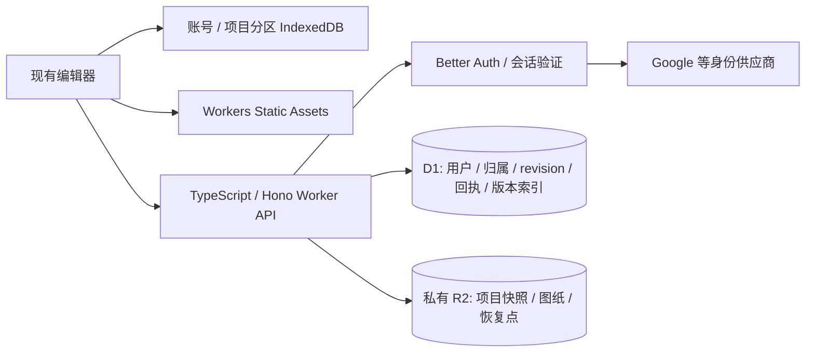

# Cloudflare 前期后端可行性调研

调研日期：2026-10-07（Asia/Shanghai）。范围：个人账号、私有项目、云保存、底图、版本恢复和早期增长。依据为当前项目代码、原技术选型文档及下列官方资料。本轮只新增调研文档，未开通服务、安装依赖或部署；下文实施步骤是建议。

## 1. 结论与推荐

**可以采用 Cloudflare 为主的后端。免费额度适合受控试用；把增长期基础预算设为 $5/月，比原 $32–50/月方案更节省固定开支。** 是否能持续零费用，主要取决于单次请求 CPU、保存频率、图纸量及认证方式，而非注册人数。

建议组合：现有原生 ESM 前端 + Workers Static Assets + TypeScript / Hono API + D1 + 私有 R2 + Better Auth（先验证 Google OAuth）+ Turnstile。保留 IndexedDB 草稿和离线 v2 JSON。Workers Paid 的基础订阅为 $5/月，套餐内用量可维持该费用；超额另计，域名和独立备份预算另列。[Workers Pricing](https://developers.cloudflare.com/workers/platform/pricing/)

这会替换原方案的 Fastify 常驻服务、Render 和 PostgreSQL 存储接入。Supabase Auth 的托管职责也需要改由认证库及应用承担，开发维护工作不会随云账单一起归零。

原方案的 revision、mutationId、权限校验、草稿隔离、文件 finalize 和恢复验收仍然适用。供应商改变不应削弱这些规则。

## 2. 当前免费额度与适配情况

| 职责 | 产品 | 官方免费条件 | 本项目建议 |
| --- | --- | --- | --- |
| 前端资源 | Workers Static Assets | 直接静态资源请求免费且不限量，无额外 Assets 存储费 | 静态资源直接服务，只让 API / 认证路径运行 Worker；别让全部资源先经过鉴权代码。[说明](https://developers.cloudflare.com/workers/static-assets/billing-and-limitations/) |
| 业务 API | Workers Free | 100,000 请求/日，HTTP 请求 10 ms CPU，128 MB 内存 | API 量适合试用；CPU 必须实测。等待网络不计 CPU，解析、校验、签名和序列化会消耗 CPU。[限制](https://developers.cloudflare.com/workers/platform/limits/) |
| 关系数据 | D1 Free | 500 万行读取/日、10 万行写入/日；账号合计 5 GB | 保存元数据、归属、revision、mutation 回执和版本索引。行读取按扫描量计费，索引也增加写入。[定价](https://developers.cloudflare.com/d1/platform/pricing/) |
| 单库及单行 | D1 Free | 单库 500 MB，最多 10 库；单行 / 字符串 / BLOB 2,000,000 bytes | “合计 5 GB”不是单库 5 GB。原文 8 MiB JSON 上限不能原样作为 D1 快照行上限。[限制](https://developers.cloudflare.com/d1/platform/limits/) |
| 快照、图片、PDF | R2 Standard | 10 GB-month/月、100 万 Class A、1,000 万 Class B/月；直接 R2 egress 免费 | 用私有 bucket 存内容和不可变版本；免费额度是按量套餐，超额会计费。[定价](https://developers.cloudflare.com/r2/pricing/) |
| 防自动化滥用 | Turnstile | 20 widgets，challenge 数量不限 | 可用于注册及敏感流程，服务端校验；不能替代用户权限和配额。[套餐](https://developers.cloudflare.com/turnstile/plans/) |
| 后台清理 | Cron Triggers | Free 最多 5 个；Free 单次 CPU 仍受 10 ms 限制 | 只做分页小批次清理；较重任务在升级后处理。[限制](https://developers.cloudflare.com/workers/platform/limits/) |
| 后台队列 | Queues Free | 10,000 operations/日，保留 24 小时 | 目前不必引入。普通小消息交付通常消耗写、读、删三次操作，不能当作每天一万条消息。[定价](https://developers.cloudflare.com/queues/platform/pricing/) |
| 事务邮件 | Email Service | Free 可路由来信、向账号内已验证目的地址发信；不能向任意用户发事务邮件 | 邮箱验证、找回密码需要 Paid 或外部邮件服务。Paid 包含 3,000 封/月，之后 $0.35/千封。[定价](https://developers.cloudflare.com/email-service/platform/pricing/) |

R2 需完成订阅 checkout，额度内账单可为零，并非没有计费入口。[开通说明](https://developers.cloudflare.com/r2/get-started/)

Workers / D1 免费日限额不是自动按量扩容：额度用尽会产生错误，D1 查询会被拒绝，存储达限会阻止新增数据。应在增长触顶前升级。[D1 超额行为](https://developers.cloudflare.com/d1/platform/pricing/)、[2026-09-01 限额执行变更](https://developers.cloudflare.com/changelog/product/d1/)

## 3. 账号与邮件的实际边界

Cloudflare 提供运行和存储基础设施，不能把 Workers + D1 当作已经具备用户注册、登录、会话撤销及找回密码的托管 Auth。

**推荐先评估 Better Auth + D1，Google OAuth 作为第一条贯通流程。** Better Auth 已官方宣布原生 D1 支持；但它是运行在应用内的认证框架，应用仍负责配置、更新、回调域、账号生命周期和权限。依赖应锁定当前稳定补丁版；官方近期 changelog 有 D1 schema / migration 修复，不直接抄旧示例冻结旧版本。[D1 支持](https://better-auth.com/blog/1-5)、[Changelog](https://better-auth.com/changelog)

Google OAuth 需要外部身份供应商，因此是“后端基础设施以 Cloudflare 为主”，不是所有依赖均为 Cloudflare。邮箱密码登录可后加，必须测试密码散列在 Worker 的 CPU / 内存表现，不能为了免费额度降低散列强度。

OpenAuth 也是可运行于 Workers 的候选，但官方仍标记 beta，推荐的 Cloudflare 存储是 KV，且刻意不处理用户管理；本项目不优先选择这条路径。[官方说明](https://openauth.js.org/docs/)

Cloudflare Access 适合保护内部管理入口，产品用户的账号生命周期与项目归属仍需应用实现。它不替代个人项目账号系统。[Access 架构与用途](https://developers.cloudflare.com/reference-architecture/architectures/sase/)

当前 Cloudflare Email Sending 是 public beta，支持 Worker binding / REST / SMTP；任意收件人发送需要 Workers Paid 和发信域配置。生产认证邮件还需实际投递及退信验收。[服务说明](https://developers.cloudflare.com/email-service/)、[开始发信](https://developers.cloudflare.com/email-service/get-started/send-emails/)

## 4. 数据布局及保存规则

建议从一开始区分关系元数据和内容对象，不在 D1 为所有恢复点长期复制整份 JSON。

Hono 官方支持 Cloudflare Workers。采用它是减少运行时适配工作；现有领域 JS 继续复用。Workers 的 Node 兼容功能不等于原常驻 Node / Fastify 方案可完全原样部署。[Hono 指引](https://hono.dev/docs/getting-started/cloudflare-workers)、[Node 兼容说明](https://developers.cloudflare.com/workers/runtime-apis/nodejs/)

- D1：用户及 session 所需表；项目 UUID、owner、名称、revision、currentObjectKey、大小/hash、时间和删除状态；版本索引、资产清单及 mutation 回执。
- R2：无底图 base64 的云容器快照、标定 raster、可选源 PDF / 图片。使用服务器控制的不可变 object key；底图与原始文件分别计量。
- IndexedDB：本地可恢复快照和离线资产。云请求发生前先保证本地草稿落盘；服务额度耗尽或网络故障仍可导出。
- 本地 v2：保持内嵌底图、无账号可独立回导。云容器加载适配器还原编辑器 v2；不直接向编辑器传 R2 临时 URL。

**保存流程建议：先验证并写入新的 R2 对象，再原子提交 D1 的条件 revision 更新、版本索引和 mutation 回执。** D1 提交失败只留下未引用对象，经过安全宽限期清理；D1 提交成功后响应丢失则由同一个 mutationId 重试取回结果。不要覆盖已经被项目或历史版本引用的对象，也不把 R2 与 D1 当成一个跨服务事务。

D1 的 `batch()` 支持 SQL 原子批次及失败回滚，但不能照搬 `pg` 的交互式事务。必须验证：条件 UPDATE 影响 0 行不是 SQL 错误，后续版本 / 回执写入不能因此照常生成“成功”结果。相关 SQL 应以同一 mutation / 条件状态为依据，并验证并发请求。[D1 batch 文档](https://developers.cloudflare.com/d1/worker-api/d1-database/)

D1 是 SQLite 路线，原文 PostgreSQL 的 schema、专用角色、RLS、JSONB 与迁移语法需重新设计。用户身份由会话验证产生，所有项目查询及修改带 owner 条件；文件下载同样先经 API 授权。不能把 object key 前缀当权限。[D1 SQL](https://developers.cloudflare.com/d1/sql-api/sql-statements/)

不使用 KV 保存当前项目、revision 或要求即时生效的撤销状态。KV 是最终一致存储，跨地区变化可能延迟 60 秒或更久，不适合项目保存所需的原子读改写。[KV 一致性](https://developers.cloudflare.com/kv/concepts/how-kv-works/)

私有文件可通过 Worker 授权流式传输或短期预签名 URL 访问。R2 预签名 URL 是持有者可用的凭证，不能当作永久身份验证；权限检查仍在签发之前。[R2 预签名 URL](https://developers.cloudflare.com/r2/api/s3/presigned-urls/)

## 5. “够用”需要按实际操作量测算

### 项目体积与 CPU

本轮在 Node v22.22.3 用 `tests/helpers/house-fixture.js` 生成 Umbria：25 空间、43 家具、无参考底图的 JSON 为 47,010 bytes。30 次领域校验中位约 4.96 ms、最大约 6.97 ms。这是本机 wall-clock 微基准，不是 Worker CPU 计量，也未包含请求解析、会话、hash、D1 / R2 的结果处理。

因此不能据此认定完整保存链路稳定低于免费 10 ms。应优先实测实际 Worker 的 CPU P95/P99，涵盖参考图适配、最大允许户型和冷启动。超限时升级，不把服务端校验移到客户端。

### 快照都放 D1 会很快耗尽单库

以下为未压缩、未计索引和其他表的理论原始体积；按每人 5 项目，每项目当前快照 + 10 个历史版本，每份 47,010 bytes：

| 已存项目的用户数 | 快照合计 | 对 D1 Free 单库的意义 |
| --- | --- | --- |
| 100 | 约 259 MB | 已占相当比例，真实库更大 |
| 500 | 约 1.29 GB | 超过 500 MB |
| 1,000 | 约 2.59 GB | 超过 500 MB |

容量推算支持将快照正文放 R2。无需为凑免费合计 5 GB 从第一天就分十个 D1 数据库。

### R2 更可能支撑早期内容增长

另一假设：每人 3 项目，每项目原图 + raster 合计平均 3 MB，保留当前 + 5 份快照，每份 50 KB；同一底图被多个版本复用，不按每版本复制图纸。

| 用户数 | R2 理论内容体积 |
| --- | --- |
| 100 | 约 0.99 GB |
| 500 | 约 4.95 GB |
| 1,000 | 约 9.9 GB |

这不是承载测试，也不含独立备份、pending、回收站及换底图留存。实际源 PDF 更大或备份复制会提前超过免费额度；例如持续存 20 GB Standard，存储本身的超额约 $0.15/月，另计操作费。[R2 定价](https://developers.cloudflare.com/r2/pricing/)

### 日写入比注册人数更有约束

假设每个日活用户每天产生 40 次真正的云保存，每次保存包括项目更新、版本索引、回执及相关索引等，共 4–8 行写入（估算，需用 D1 `meta.rows_written` 测实值）：

| DAU | 保存请求/日 | 估计 D1 写入行/日 |
| --- | --- | --- |
| 100 | 4,000 | 16,000–32,000 |
| 500 | 20,000 | 80,000–160,000 |
| 1,000 | 40,000 | 160,000–320,000 |

另有登录、项目列表、资产和清理流量。故可能在 Workers 10 万请求/日前，D1 先触及 10 万写入行/日。原文约 1 秒防抖不能等同每秒永久生成一个版本；本地即时保存，云端合并提交，历史检查点按内容和时间策略保留。日限额重置为 UTC 00:00，即北京时间 08:00。[行计量规则](https://developers.cloudflare.com/d1/platform/pricing/)

## 6. 费用及升级触发点

| 阶段 | 建议 | 基础费用条件 |
| --- | --- | --- |
| 本地 / 小范围试用 | Workers Free + D1 Free + R2 Standard 免费用量 + Google OAuth | Cloudflare 使用费可为 $0；认证库、域名及外部供应商不因此免费 |
| 公开试运营 / 增长 | Workers Paid + D1 + R2 + 按需事务邮件 | Workers 基础 $5/月；用量在各套餐内时可维持，超额另计 |
| 较多图纸或保存 | 继续按量扩容，不立即迁移整套架构 | R2 $0.015/GB-month；D1 超过付费包含 5 GB 后 $0.75/GB-month；付费单库最大 10 GB，后续需规划 |

依据：[Workers Pricing](https://developers.cloudflare.com/workers/platform/pricing/)、[D1 Pricing](https://developers.cloudflare.com/d1/platform/pricing/)、[D1 Limits](https://developers.cloudflare.com/d1/platform/limits/)、[R2 Pricing](https://developers.cloudflare.com/r2/pricing/)。付费套餐是多个产品各自的额度，不是 $5 无限资源；不必购买网站 Pro 套餐才使用 Workers Paid。

建议内部预警值（工程建议，不是平台官方阈值）：

- Worker 完整保存 CPU P95 达到 6–7 ms、P99 接近 10 ms，或出现 CPU 超限：升级 / 优化。
- API 超过 60,000 请求/日，或 D1 超过 60,000 写入行/日：预留升级余量。
- D1 单库超过 300 MB：检查增长率和保留策略；不要等写入被拒绝。
- R2 接近 7 GB-month：根据下一批用户和图纸量预估；无需为少量超额做复杂分片。
- 需要任意收件人事务邮件：Workers Paid 或独立邮件供应商。

## 7. 原技术方案需要修改的地方

| 原方案 | Cloudflare 路线 |
| --- | --- |
| Node 24 / Fastify / Docker / Render | TypeScript / Hono / Workers / Wrangler；验证共享 JS 打包 |
| Supabase PostgreSQL / `pg` / JSONB / RLS | D1 参数化 SQL、批次原子性、应用层归属授权；重写迁移 |
| 数据库保存所有快照正文 | D1 保存索引和当前指针，R2 保存不可变正文 |
| Supabase Auth | Better Auth + D1；先贯通 OAuth，再决定邮箱密码 / passkey |
| Supabase 私有 Storage | R2 私有 bucket + 授权 API / 签名；重做 finalize 与配额预留 |
| Supabase SQL migrations | Wrangler D1 migration 历史；认证及业务表使用统一可审查流程 |
| PostgreSQL 备份 | D1 Time Travel + 导出，R2 文件另做备份与联合恢复 |
| 8 MiB JSON 请求上限 | 根据 Worker CPU 实测冻结更保守的云请求上限；底图及源文件直接走资产流程 |

D1 Free Time Travel 为 7 天，Paid 为 30 天。它是数据库事故恢复，不等于单项目版本恢复，也不覆盖 R2 文件备份。[平台保留期](https://developers.cloudflare.com/d1/platform/limits/)、[恢复说明](https://developers.cloudflare.com/d1/reference/time-travel/)

## 8. 建议先验证的交付

沿用 BE-01～BE-04，在 BE-01 加入小型 Worker 验证，不另启动一套功能路线：

1. Umbria、含 raster 项目及允许的最大项目，在真实 Worker 完成解析、可信身份验证、领域校验和写入，记录 CPU 分布及 D1 行计量。
2. A / B 真实账号互不读取项目、版本和 R2 文件；退出 / 换账号隔离本地草稿及 Undo / Redo。
3. 同 revision 并发只能一个保存成功；条件更新 0 行、重复 mutation、R2 成功而 D1 失败、提交后丢响应均不出现假成功。
4. Chrome 保存，Safari 同账号恢复；离线导出 v2 JSON 仍可独立回导含底图工程。
5. 删除恢复及历史底图回载；D1 恢复与 R2 资产清单联合恢复。

本轮未验证用户 Cloudflare 账号、Email Sending 开通条件、域名、云端 CPU、远程事务或实际 OAuth 登录。上述真实环境验证是后续实施内容。

**选型建议：把 Cloudflare 路线列为低固定成本优先方案，免费试用后按 CPU / 写入指标升级到 $5/月；原 Supabase + Render 路线保留为减少认证和关系数据库实施工作的备选。**
